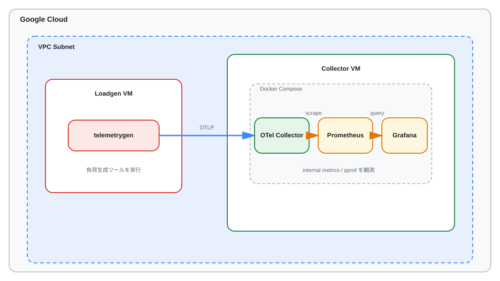

# OTel Collector メモリデバッグ検証環境

## このリポジトリについて
- OpenTelemetry Collector のメモリ高騰パターンを再現し、デバッグ手法を検証するための検証環境です。
- 3つのシナリオ（Tail Sampling / SpanMetrics 高カーディナリティ / Batch × Queue メモリ増幅）を用意しています。
- Google Cloud（Terraform, 2VM構成）で実行できます。

## 前提条件
- Go（`go tool pprof` が使えること。推奨: 1.21+）
- Python 3.10+（`scenario-spanmetrics*` 実行時に使用）
- gcloud CLI
- Terraform v1.14+

## クイックスタート（Google Cloud）

```bash
export PROJECT_ID=$(gcloud config get-value project)
```

最短で実行する場合は `run-*` コマンドだけで完結します。

```bash
make run-tail-sampling                    # Tail Sampling シナリオを実行
make run-tail-sampling-optimized          # 最適化版を実行
```

> **注意**: `run-*` コマンドは内部で Terraform apply（`-auto-approve`）→ VM同期 → サービス再起動 → シナリオ実行 → pprofキャプチャ → メトリクス収集 → インフラ削除を自動で行います。初回はインフラが確認なしで作成されるため、意図せずリソースが作成されないよう `PROJECT_ID` を確認してから実行してください。インフラを残したい場合は `DESTROY=0` を付けてください。

結果は `captures/<MM-DD>/<HHMMSS>/` 以下に保存されます（pprof: `pprof/`、メトリクス: `metrics/`、Grafana画像: `images/`）。

個別に操作したい場合:

```bash
make -C terraform apply         # インフラ作成のみ
make -C terraform forward       # ポートフォワード（Grafana: :3000、Prometheus: :9090、Jaeger: :16686）
make -C terraform destroy       # 後片付け
```

### Google Cloud アーキテクチャ



## シナリオ一覧

| シナリオ | 原因 | 実行コマンド | ブログ記事 |
|---------|-----|------|------|
| Tail Sampling | `decision_wait` 中のトレースバッファ保持 | `make run-tail-sampling PROJECT_ID=...` | 公開済み |
| SpanMetrics 高カーディナリティ | `spanmetrics` 内部マップのエントリ数膨張 | `make run-scenario-spanmetrics PROJECT_ID=...` | 別シナリオ（続編予定） |
| Batch × Queue メモリ増幅 | `send_batch_size × queue_size` の掛け算 | `make run-batch-queue PROJECT_ID=...` | 別シナリオ（続編予定） |

※ 各シナリオに最適化版（`*-optimized`）があります。

## 各シナリオの詳細

### Tail Sampling
- 何が起きるか: `tail_sampling.decision_wait` の間、スパンを保持するため高スループット時にメモリが急増
- 最適化版: `make run-tail-sampling-optimized`（`decision_wait: 30s -> 5s`）
- 期待される挙動: Heap 上昇、`memory_limiter` 発動、Refused 増加の観察

### Batch × Queue メモリ増幅
- 何が起きるか: バックエンド遅延時に exporter queue が滞留し、`batch_size × queue_size` 分のデータがメモリを圧迫
- 最適化版: `make run-batch-queue-optimized`（`send_batch_size: 8192 -> 2048`, `queue_size: 1000 -> 50`）
- 注意: `docker-compose.batch-queue.yaml` で Jaeger に CPU 制限をかけて遅延を再現

### SpanMetrics 高カーディナリティ
- 何が起きるか: `spanmetrics` の `dimensions` に高カーディナリティ属性を入れると組み合わせ爆発で内部マップが膨張
- 最適化版: `make run-scenario-spanmetrics-optimized`（`attr_0`, `attr_1` を `dimensions` から除外）
- 注意: `pip3 install -r pyloadgen/requirements.txt` が必要

## pprof の使い方
- `make pprof-heap` — ヒーププロファイルを取得してブラウザ表示
- `make pprof-capture-bg` — バックグラウンドで定期キャプチャ開始
- `make pprof-capture-stop` — キャプチャ停止
- `make pprof-diff-auto DIR=path/to/captures/XXXXXX` — ベースラインとピークを自動比較

## ディレクトリ構成
```text
.
├── docker-compose.yaml                    # 検証環境（Collector/Prometheus/Jaeger/Grafana）
├── docker-compose.batch-queue.yaml        # Batch×Queue用オーバーレイ（Jaeger CPU制限）
├── Makefile                               # Google Cloud 統合実行ターゲット
├── otel-collector/                        # Collector本体設定とシナリオ設定
│   └── scenarios/
├── pyloadgen/                             # Python 負荷生成（高カーディナリティ属性付きトレース）
├── scripts/                               # pprofキャプチャ/比較、Grafanaメトリクスエクスポート
├── grafana/                               # ダッシュボード/データソース定義
├── prometheus/                            # Prometheus 設定
├── terraform/                             # Google Cloud 環境（2VM構成）と運用 Makefile
├── docs/blog/                             # 記事草案・構成・シナリオレポート
└── captures/                              # pprof/メトリクス取得結果（git管理外）
```
