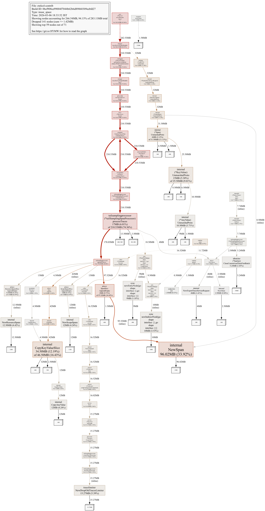

# OpenTelemetry Collector のメモリ高騰を Grafana と pprof でデバッグする

## はじめに

OpenTelemetry Collector の導入が広がるにつれ、メモリ使用量の高騰という問題が顕在化しやすくなっています。Receiver・Processor・Exporter を組み合わせてパイプラインを定義できますが、パラメータ調整が甘いとメモリ使用量が高騰してしまいます。問題が顕在化するのは負荷が本番レベルに達したときで、そのときにはすでにデータが欠損していることが多いです。

特に監査ログを扱っている場合、重要な情報が欠損する可能性があり無視できません。

対処を難しくしているのは、同じ「メモリ高騰」でも原因構造が一様ではない点です。原因が違えば対処も変わります。原因を特定せずにコンテナのメモリを増やしても根本解決にはなりません。

本記事では Tail Sampling Processor を題材にOTel Collector の内部テレメトリと pprof を使い、メモリ高騰の原因を特定し、パラメータ変更で改善するまでの過程を追います。

検証環境は OpenTelemetry Collector Contrib v0.140.1（2026 年 2 月時点の最新版）、コンテナメモリ制限 512MB の環境で実施しました。バージョンによりデフォルト値やメトリクス名が異なる場合があります。

## デバッグの基本技法と環境準備

今回のデバッグでは内部メトリクス（Grafana で可視化）と pprof（heap profile） を中心に使いました。前者で何が起きているかを把握し、後者でなぜ起きているかを具体的にどの関数でメモリが高騰しているのかを掘り下げます。

### 内部メトリクス

| メトリクス | 何がわかるか |
| --- | --- |
| `otelcol_process_runtime_heap_alloc_bytes` | 現在の Heap 使用量。GC 後も下がらなければリーク疑い |
| `otelcol_receiver_refused_{spans,metric_points,log_records}_total` | Collector がメモリ超過を理由に受信を拒否した回数。継続して発生している場合、クライアントの再送実装次第でデータロスになりうる |
| `otelcol_exporter_send_failed_{spans,metric_points,log_records}_total`  | バックエンドへの送信失敗数。リトライがあるためデータロスを直接意味するわけではないが、継続して高い場合はネットワークやバックエンドの問題を示す |
| `otelcol_exporter_queue_size` | Exporter の送信キュー使用量。100% 張り付きは下流の遅延・停止を示す |

まずはこれらのメトリクスから確認するとよいでしょう。

このうち `otelcol_receiver_refused_*` と `otelcol_exporter_send_failed_*` は[公式ドキュメントの Monitoring セクション](https://opentelemetry.io/docs/collector/internal-telemetry/#monitoring)内 Receive failures で、`otelcol_exporter_queue_size` は同セクションの Queue length で挙げられているメトリクスです。

`otelcol_process_runtime_heap_alloc_bytes` はメモリデバッグの観点から本記事が加えています。加えて、Processor / Connector 固有のメトリクス（`otelcol_processor_<name>_*`）を Prometheus API で列挙すると、パイプライン内部のどこでデータが滞留しているかを特定できます。

メトリクス名や取得方法の詳細は[公式ドキュメント（Internal Telemetry）](https://opentelemetry.io/docs/collector/internal-telemetry/)を参照してください。OTel Collector はリリースサイクルが速いため、メトリクス名やデフォルト値がバージョン間で変わる可能性があります。本記事の内容と差異がある場合は、公式ドキュメントの記述を優先してください。

### pprof

メトリクスで「Heap が増えている」ことがわかっても、「どの関数がメモリを確保しているか」まではわかりません。pprof は Go 標準のプロファイリング機能で、heap profile を取得すると、関数ごとのメモリ使用量の内訳を確認できます。

OTel Collector では [pprof extension](https://github.com/open-telemetry/opentelemetry-collector-contrib/tree/main/extension/pprofextension) を有効にすると、HTTP endpoint 経由で heap profile を取得できます。

```yaml
extensions:
  pprof:
    endpoint: 0.0.0.0:1777

service:
  extensions: [pprof]
```

```bash
# heap profile の取得と対話的な解析
go tool pprof http://<collector-host>:1777/debug/pprof/heap
```

pprof の出力には、主に **flat** と **cum** という 2 つの指標があります。

- **flat**: その関数自身が直接確保したメモリ量
- **cum**（cumulative）: その関数と、そこから呼び出される関数を含めた累積のメモリ使用量

メモリ高騰の原因を追うときは flat だけでなく cum を確認することが重要です。flat が小さくても cum が大きい関数は、呼び出し先を含めた経路全体でメモリを保持しています。この区別は実践検証セクションで繰り返し使います。

### memory_limiter

シナリオに入る前に、もう 1 つ押さえておくべき仕組みがあります。

`memory_limiter` は Collector のメモリ使用量を監視し、閾値を超えると新規データの受信を拒否する processor です。[公式の Recommended Processors](https://github.com/open-telemetry/opentelemetry-collector/tree/main/processor#recommended-processors) の 1 番目に挙げられており、パイプラインの先頭に配置します。

本記事の検証環境では以下の設定を使用しています。

```yaml
memory_limiter:
  check_interval: 1s
  limit_percentage: 80
  spike_limit_percentage: 20
```

受信拒否が始まる実効閾値（soft_limit）は `コンテナメモリ × (limit_percentage - spike_limit_percentage)` で計算されます。本環境では `512 MB × (80% - 20%) = 307 MB` です。Heap がこの値に達すると、Receiver が新規スパンの受信を拒否し始めます。

### 検証環境

本記事のデータは Google Cloud 上で取得しました。Loadgen VM と Collector VM の 2 インスタンス構成で、負荷生成と Collector を分離しています。Collector VM では OTel Collector、Prometheus、Grafana を `docker compose` で起動しています。負荷生成には **telemetrygen**（OpenTelemetry 公式）を使用しています。telemetrygen は OpenTelemetry Collector のデモや動作確認でも使われているテスト用ツールで、gRPC/OTLP プロトコルで Collector にトレースを送信します。実アプリケーションでは各言語の **OpenTelemetry SDK** を組み込んでトレースを生成・送信しますが、OTel SDK を直接使った負荷生成は本記事では使用していません。環境構築手順そのものは本記事では扱わず、取得済みのメトリクス、pprof、クライアントログをもとにデバッグの流れに絞って説明します。

### 診断フロー

本記事では以下のフローに沿って検証を進めます。

```
メトリクスで異常を検知 → pprof で原因を特定 → パラメータを変更 → 再テストで改善を確認
```

次章では、Tail Sampling Processor を対象にこのフローを実践します。

## 実践検証: Tail Sampling

Tail Sampling は、トレースの全スパンが揃ってからサンプリング判定を行う processor です。判定までの待機時間 `decision_wait` の間、受信したトレースをメモリに保持します。

つまり、`decision_wait` が長いほど、その間に流入するトレースがすべてメモリに積み上がります。流量が多い環境では、この保持量だけでコンテナのメモリ制限に達しえます。

### 再現条件

`tail_sampling` processor を以下の設定で動作させました。パイプラインには `batch` も含まれており、pprof でどちらがメモリ消費の主因かを切り分けます。

```yaml
tail_sampling:
  decision_wait: 30s
  num_traces: 100000
  policies:
    - name: always-sample
      type: always_sample      # 検証用に全トレースをサンプリング

batch:
  send_batch_size: 2048
  timeout: 1s

service:
  pipelines:
    traces:
      receivers: [otlp]
      processors: [memory_limiter, tail_sampling, batch]
      exporters: [debug]
```

負荷条件: telemetrygen で 2,500 traces/sec（各トレース 1 root + 10 child = 27,500 spans/sec 相当）を 2 分間投入しました。

```bash
telemetrygen traces --otlp-endpoint $(ENDPOINT) --otlp-insecure \
  --rate 2500 --duration 120s --workers 10 --child-spans 10
```

### 問題の発見（Grafana 観測）

#### Heap の推移

まず `otelcol_process_runtime_heap_alloc_bytes` を確認します。


Heap は負荷開始後に急上昇し、soft_limit（307 MB）を超えた水準で高止まりしています。GC が動いてもメモリが戻りきらない状態が続いています。

#### Accepted rate の低下

Heap の高止まりだけでは、データに影響が出ているかまでは判断できません。次に `rate(otelcol_receiver_accepted_spans_total)` を確認します。


このグラフの縦軸は `spans/sec` です。一方、負荷条件で指定している `telemetrygen --rate 2500` は `traces/sec` なので、単位は一致していません。今回は 1 トレースあたり `1 root + 10 child = 11 spans` を生成しているため、投入量を同じ単位に揃えると理論値は `2,500 traces/sec × 11 = 27,500 spans/sec` になります。したがって、このパネルでは「2,500」と直接比較するのではなく、「27,500 spans/sec に対して実際に何 spans/sec 受信できているか」を見ています。

ただし、telemetrygen は今回の環境では `--rate 2500` の指定どおりのレートを実行しておらず、ログ上の生成量は 953,566 traces（= 10,489,226 spans）でした。理論値 1,500,000 traces（= 16,500,000 spans）に対して約 6 割で、`child_spans=10` による生成コスト増加が一因と考えられます。

それでも Receiver の受信レートは実送信量に対しても低い水準で推移しており、投入したスパンの多くが受信されていないことがわかります。同じグラフに表示されている Refused Spans は非ゼロですが微量で、この数値だけでは損失の規模を説明できません。

ここまでの Grafana 観測で「Heap が soft_limit を超えている」「スループットが低下している」「memory_limiter が発火している」ことがわかりました。次は pprof で、何がメモリを消費しているかを特定します。

### pprof で原因を特定

Heap がピーク付近のタイミングで取得した heap profile を確認します。pprof の `top` はデフォルトで flat（その関数自身が確保したメモリ）順に表示します。

```bash
# 例
go tool pprof -inuse_space heap.pprof
(pprof) top
```

```
Showing nodes accounting for 227.18MB, 89.54% of 253.71MB total
Dropped 92 nodes (cum <= 1.27MB)
Showing top 10 nodes out of 84
total: 280.98 MB、上位 10 関数を flat 順に整理しました（パッケージパスは短縮表記）。
```

| flat | flat% | cum | cum% | 関数 |
|---:|---:|---:|---:|---|
| 117.53 MB | 41.83% | 117.53 MB | 41.83% | `pdata/internal.NewSpan` |
| 37 MB | 13.17% | 52.50 MB | 18.69% | `pdata/internal.CopyKeyValueSlice` |
| 16.50 MB | 5.87% | 29 MB | 10.32% | `pdata/internal.(*KeyValue).UnmarshalProto` |
| 15.50 MB | 5.52% | 15.50 MB | 5.52% | `pdata/internal.CopyAnyValue` |
| 14.50 MB | 5.16% | 14.50 MB | 5.16% | `pdata/internal.NewResourceSpans` |
| 13 MB | 4.63% | 13 MB | 4.63% | `pdata/internal.NewScopeSpans` |
| 12.50 MB | 4.45% | 12.50 MB | 4.45% | `pdata/internal.(*AnyValue).UnmarshalProto` |
| 6 MB | 2.14% | 35 MB | 12.46% | `pdata/internal.(*Span).UnmarshalProto` |
| 5.50 MB | 1.96% | 119.02 MB | 42.36% | `pdata/ptrace.SpanSlice.AppendEmpty` |
| **5 MB** | **1.78%** | **214.53 MB** | **76.35%** | **`tailsampling.processTraces`** |

上位の大半は `pdata/internal` パッケージの関数です。pdata は OTel Collector の内部データ表現で、受信した Protocol Buffers メッセージを Go の構造体にデシリアライズしたものです。ここからわかるのは「どこでメモリが確保されたか」であり、パイプライン内のどの processor がそれを保持しているかまでは判断できません。`batch` が原因なのか `tail_sampling` が原因なのか、flat だけでは切り分けられない状態です。

そこで `top -cum` に切り替えます。cum（cumulative）は、その関数と呼び出し先を含めた累積のメモリ使用量です。上位には gRPC フレームワーク層の関数も並びますが、ここでは `tail_sampling` に関係する行だけを抜粋します。

そこで `top -cum` に切り替えます。`tail_sampling` に関係する行を抜粋します（パッケージパスは短縮表記）。

| flat | flat% | cum | cum% | 関数 |
|---:|---:|---:|---:|---|
| 0 | 0% | 214.53 MB | 76.35% | `tailsampling.(*tailSamplingSpanProcessor).ConsumeTraces` |
| **5 MB** | **1.78%** | **214.53 MB** | **76.35%** | **`tailsampling.(*tailSamplingSpanProcessor).processTraces`** |

`processTraces` の flat はわずか 5 MB ですが、cum は 214.53 MB（全体の 76%）に達しています。先ほど flat で上位に並んでいた `NewSpan` や `CopyKeyValueSlice` は、この `processTraces` の呼び出し経路上で確保されたメモリでした。つまり、pdata のメモリを保持し続けている起点は `tail_sampling` です。

コールグラフで視覚的に確認します。



`processTraces` から `NewSpan` への太い矢印が、保持の連鎖を示しています。パイプラインには `batch` も含まれていますが、メモリ消費の大部分は `tail_sampling` の内部バッファです。

`processTraces` は Tail Sampling Processor がスパンを受け取ってからサンプリング判定を下すまでの間、データをメモリに保持する処理です。`decision_wait=30s` の間に到着するすべてのトレースがこのバッファに蓄積されるため、投入レートが高いほどメモリ消費は急激に増加します。

pprof により、メモリを保持している起点が `tail_sampling` であることは特定できました。ただし、ここでわかるのは原因であって、どれだけのデータが失われたかではありません。Grafana 上の Refused は微量だったため、Collector の内部メトリクスだけでは実害の大きさを判断しきれません。そこで次に、クライアント側のログと生成量を確認し、影響範囲を把握します。

### クライアントログで実害を確認

この時点では、Grafana 上の Refused Spans は微量だったため、memory_limiter は発火していても影響は限定的だろうと考えていました。しかし Accepted rate の低下幅が大きく、この見立てだけでは説明がつきません。そこで初めて、Collector の外側で何が起きているかを確認する必要があると判断しました。

クライアント（telemetrygen）のログを確認すると、以下のエラーが記録されていました。

```
traces export: exporter export timeout: rpc error: code = Unavailable
desc = data refused due to high memory usage
```

`data refused due to high memory usage` は memory_limiter が生成するメッセージです。Collector がメモリ超過を理由に受信を拒否していることがクライアント側からも確認できます。

telemetrygen のログに記録された生成数と、Collector の `otelcol_receiver_accepted_spans_total` を突合します。

| 指標 | 値 |
|------|-----|
| telemetrygen 生成トレース数 | 約95万 traces |
| 生成スパン数 | 約1,049万 spans |
| Receiver Accepted | 約611万 spans |
| **到達率** | **約58%** |

> **注記**: これらの値は telemetrygen のログと Collector のメトリクスから算出した概算値です。集計タイミングのずれや丸めの影響があるため、厳密な一致ではなく傾向を見るための値として扱ってください。

ここで初めて、全体の約 42%（~約437 万 spans）が Collector に到達していないことがわかりました。Refused が数百件しか見えていなかったため、ここまで大きな欠損が出ているのはかなり意外でした。欠損はクライアント側の gRPC timeout やスループット低下という形で顕在化しており、Collector の内部メトリクスだけでは実害の規模を読み取れませんでした。

Refused と実際の損失が大きく乖離する背景として、memory_limiter が拒否した瞬間は Refused カウンタに記録される一方、Collector 側のメモリ圧力に伴うクライアント側の timeout やスループット低下は Collector のメトリクスには現れません。さらに Go SDK では、ドロップしたスパン数をメトリクスとして公開する仕組みが未実装です（[Issue #5557](https://github.com/open-telemetry/opentelemetry-go/issues/5557)）。Collector のメトリクスだけを見ていると、損失の規模を見誤る可能性があります。

### 修正と確認

`decision_wait` を 30s から 5s に短縮して再テストします。それ以外のパラメータはすべて同一です。

```yaml
tail_sampling:
  decision_wait: 5s    # 30s → 5s
  num_traces: 100000
  policies:
    - name: always-sample
      type: always_sample
```


Heap は soft_limit を大きく下回る水準で安定しており、memory_limiter は一度も発火していません（Refused = 0）。

Receiver Spans Rate も確認します。


Non-opt で見られた受信レートの低下が解消され、Non-opt より高い受信レートで安定しています。

Non-opt と同様にクライアント側を確認すると、gRPC エラーは 0 件でした。生成数と Accepted の突合結果を Non-opt と対比します。

| 指標 | Non-opt (30s) | Opt (5s) |
|------|--------------|----------|
| 生成スパン数 | 約1,049万 | 約733万 |
| Receiver Accepted | 約611万 | 約732万 |
| 到達率 | 約58% | ほぼ100% |
| クライアント gRPC エラー | あり | なし |

non-opt で 42% あった欠損が、`decision_wait` の短縮により解消されています。Collector のメモリ問題を修正したことで、クライアント側の損失も同時になくなりました。

ただし、5s はこの検証環境で有効だった値であり、すべての環境に適用できるわけではありません。`decision_wait` を短縮すると late-arriving span を取りこぼす可能性があるため、サービス間のレイテンシを考慮した調整が必要です。

pprof でも改善を確認します。`tail_sampling` に関係する行のみ抜粋します。

`tail_sampling` に関係する行を抜粋します（パッケージパスは短縮表記）。

| flat | flat% | cum | cum% | 関数 |
|---:|---:|---:|---:|---|
| 0 | 0% | 72.01 MB | 70.67% | `tailsampling.(*tailSamplingSpanProcessor).ConsumeTraces` |
| **14 MB** | **13.74%** | **72.01 MB** | **70.67%** | **`tailsampling.(*tailSamplingSpanProcessor).processTraces`** |

Non-opt と対比します。

| 指標 | Non-opt (30s) | Opt (5s) |
|------|--------------|----------|
| processTraces cum | 214.53 MB (76%) | 72.01 MB (71%) |
| total heap | 280.98 MB | 101.90 MB |

cum の割合は依然として高いですが、絶対量は 214 MB から 72 MB と 3 分の 1 以下に減少しています。total も 280 MB から 101 MB に縮小しました。バッファの保持期間が短くなったことで、同時にメモリ上に存在するトレース数が減った結果です。

### 要点

`decision_wait` はサンプリング精度とメモリ消費のトレードオフです。値を大きくすれば late-arriving span を待てるため判定精度は上がりますが、その間のトレースデータがすべてメモリに蓄積されます。投入レートが高い環境では、この蓄積がメモリを圧迫し、データ欠損につながります。

また、Collector のメトリクスだけでは損失の全体像を把握できないことがわかりました。memory_limiter の Refused は微量でも、クライアント側では大量のデータが消失している場合があります。本番環境では、クライアントのエラーログや生成数と受信数の突合も含めて影響範囲を評価する必要があります。

## まとめ

最終的な修正は `decision_wait: 30s` を `5s` に変えるだけでした。しかし、そこに至るまでには Grafana、pprof、クライアントログという 3 つの異なるレイヤーを横断する必要がありました。

Grafana の Heap パネルで異常に気づくことはできます。しかし、Collector 内部のどの processor がメモリを圧迫しているかは Grafana だけではわかりません。pprof の `top -cum` で初めて `processTraces` が保持の起点だと特定できました。さらに、Collector のメトリクス上は Refused が微量であるにもかかわらず、クライアント側では約 4 割のデータが消失していました。Collector の内部メトリクスだけを見ていたら、この損失には気づけなかったはずです。

メモリ高騰のデバッグは、単一のダッシュボードや単一のツールで完結するものではありません。Collector の外側まで含めて全体を俯瞰して初めて、影響の実態が見えてきます。

なお、本記事の検証は `tail_sampling` + `batch` + `debug` exporter という最小構成で実施しています。本番環境では複数の processor や外部バックエンドへの exporter が加わるため、メモリ消費のパターンはより複雑になります。ここで示した診断フローは同様に適用できると思いますが、pprof の結果の解釈は環境に応じて異なる点に注意してください。
