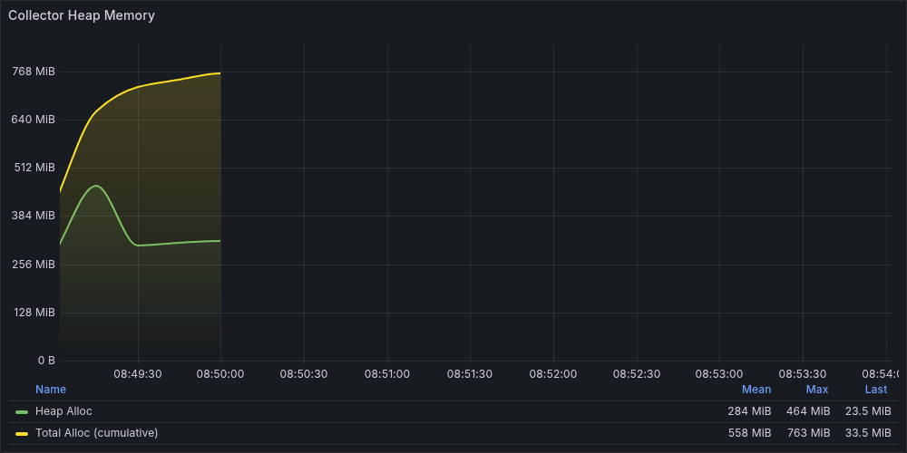
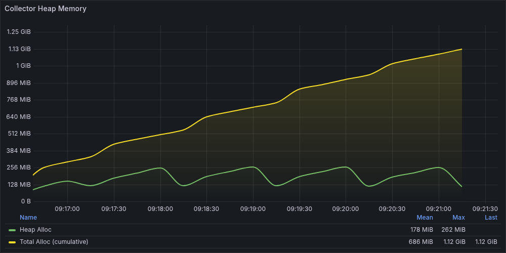
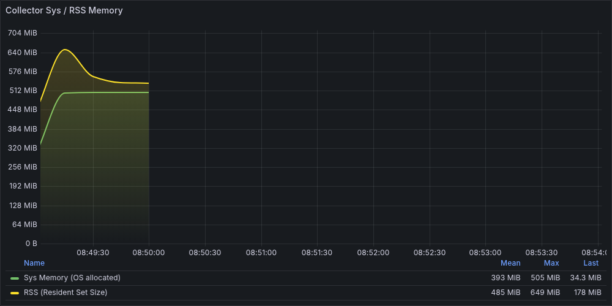
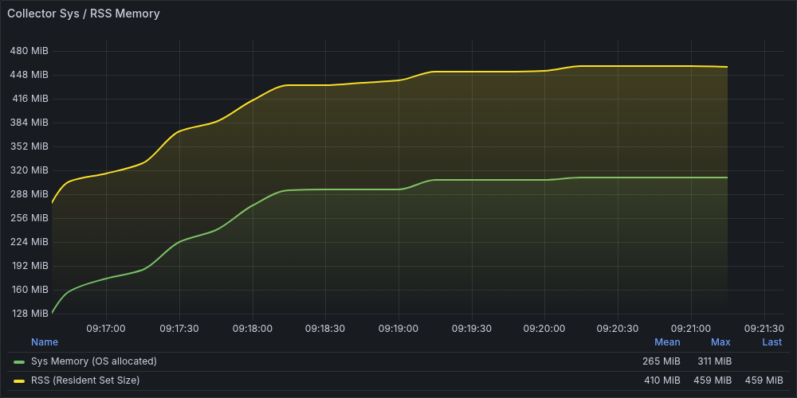
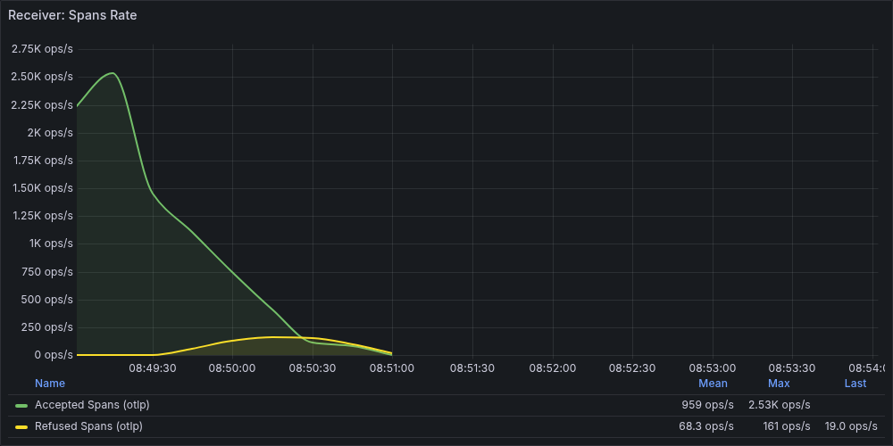
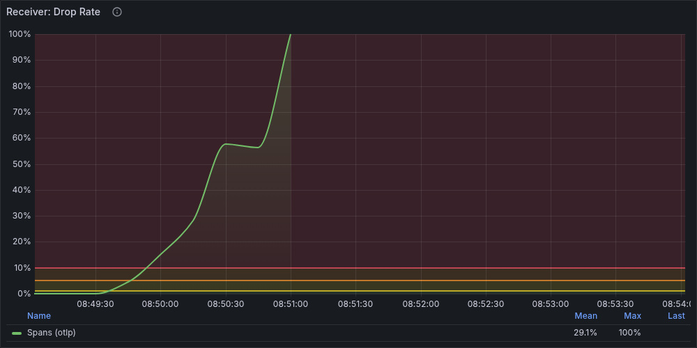
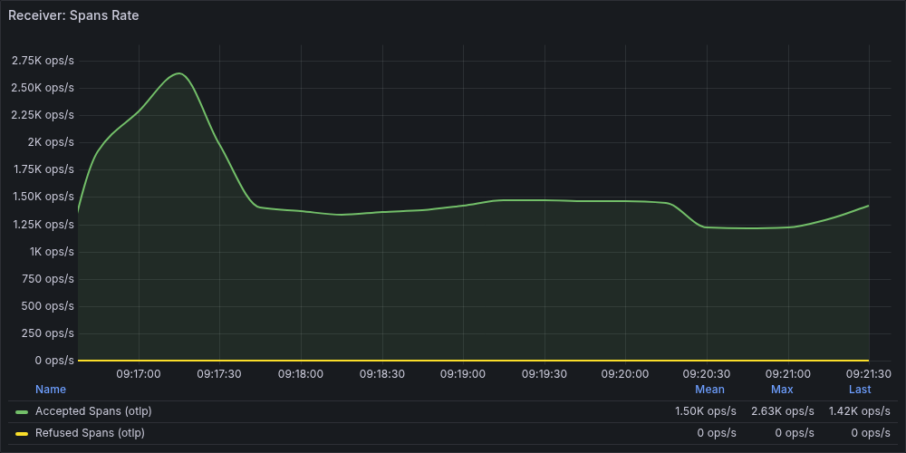
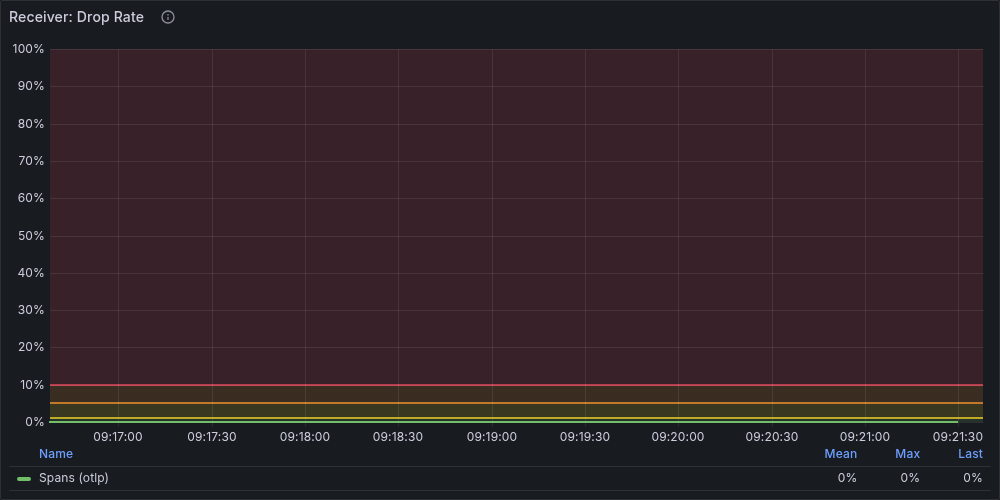

## 1. 概要

`spanmetrics` connector は、トレースからメトリクス（レイテンシヒストグラムやスループットカウンタ）を自動生成する。
`dimensions` に複数の中カーディナリティ属性を含めると、個々の値は妥当でも **掛け算で組み合わせ爆発** が起き、内部マップが膨張する。

このレポートでは、`dimensions` に 5 属性を含む設定（非最適化: 50×30×20×10×5 = 1,500,000 時系列）と
3 属性に絞った設定（最適化: 20×10×5 = 1,000 時系列）の 2 条件で同一負荷を与え、
メモリ挙動の違いを Grafana メトリクスと pprof で観測・比較する。

**核心**: `memory_limiter` は新規データの受信を拒否できるが、`spanmetrics` の内部マップに既に蓄積されたエントリは解放できない。
memory_limiter が発火して Refused Spans を記録しても、内部マップは縮小せず OOM Kill に至る。

## 2. 再現手順

### 2.1 Collector 設定（非最適化 — 問題設定）

```yaml
connectors:
  spanmetrics:
    histogram:
      explicit:
        buckets: [1ms, 5ms, 10ms, 50ms, 100ms, 500ms, 1s, 5s]
    dimensions:
      - name: attr_0    # API endpoint 相当 (50種類)
      - name: attr_1    # backend host 相当 (30種類)
      - name: attr_2    # deploy version 相当 (20種類)
      - name: attr_3    # client region 相当 (10種類)
      - name: attr_4    # HTTP method 相当 (5種類)
    # 50 × 30 × 20 × 10 × 5 = 1,500,000 ユニーク組み合わせ（組み合わせ爆発）
    aggregation_temporality: AGGREGATION_TEMPORALITY_CUMULATIVE

processors:
  memory_limiter:
    check_interval: 1s
    limit_percentage: 80
    spike_limit_percentage: 20
```

ポイント:
- `dimensions` に `attr_0`〜`attr_4` を指定。個々のカーディナリティは妥当（50, 30, 20, 10, 5）だが、掛け算で **1,500,000** の組み合わせが発生する
- `AGGREGATION_TEMPORALITY_CUMULATIVE` により、`metrics_expiration` のデフォルトが 0（無期限）のため、エントリは一方向に増加し続ける
- Exporter は `debug` のみ。Jaeger/Prometheus を除外し、spanmetrics の内部マップが唯一のメモリ消費源となるよう単因子性を確保
- batch processor は除外。spanmetrics 単体のメモリ影響を観測する

### 2.2 Collector 設定（最適化）

```yaml
connectors:
  spanmetrics:
    histogram:
      explicit:
        buckets: [1ms, 5ms, 10ms, 50ms, 100ms, 500ms, 1s, 5s]
    dimensions:
      - name: attr_2    # deploy version 相当 (20種類)
      - name: attr_3    # client region 相当 (10種類)
      - name: attr_4    # HTTP method 相当 (5種類)
    # 20 × 10 × 5 = 1,000 ユニーク組み合わせ（有界）
    aggregation_temporality: AGGREGATION_TEMPORALITY_CUMULATIVE
```

高カーディナリティ属性（`attr_0`: 50 種、`attr_1`: 30 種）を `dimensions` から除外し、
低カーディナリティ属性（`attr_2`〜`attr_4`）のみ残す。
組み合わせ数が **1,500,000 → 1,000** に減少し、内部マップのサイズが有界になる。
デフォルトキー（`service.name`, `span.name`, `span.kind`, `status.code`）は引き続き含まれる。

### 2.3 負荷条件

両シナリオ共通:

```
Loadgen:          pyloadgen (Python + OTel SDK)
Rate:             1,300 traces/sec
Duration:         300s（5分）
Workers:          10
Attributes:       8（attr_0〜attr_7）
                  カーディナリティ: [50, 30, 20, 10, 5, 3, 3, 3]
Span Depth:       5（1トレース = 6スパン → 7,800 spans/sec）
Container Memory: 512 MB
```

各属性の値は固定プールからランダムに選択される。
個々の属性値は実務で妥当なレベル（API エンドポイント 50 種、バックエンドホスト 30 台 等）だが、
`dimensions` に全て含めると掛け算で組み合わせ爆発する。

実行コマンド:

```bash
# 非最適化（dimensions に 5 属性を含む — 組み合わせ爆発）
make run-scenario-spanmetrics

# 最適化（dimensions を 3 属性に絞る — 組み合わせ数を有界に）
make run-scenario-spanmetrics-optimized
```

## 3. Grafana での観測

### 3.1 Heap Memory の挙動

#### 非最適化（dimensions に 5 属性 — 組み合わせ爆発）



| タイムスタンプ | Heap | 説明 |
|--------------|------|------|
| 09:32:52 | 312.10 MB | **唯一のメトリクスポイント**（Uptime 50.85s） |
| 09:32:52〜 | (データ消失) | Collector が OOM Kill され、メトリクス取得不能 |

特徴: メトリクスが **1ポイントのみ** で途切れる。Heap 312.10 MB は Docker の memory limit（512 MB）の 61% だが、
Go の Heap は RSS の一部でありランタイムオーバーヘッドを含まない。RSS はこの時点で 491.27 MB（96%）に達しており、
直後に OOM Kill が発生している。

#### 最適化（dimensions を 3 属性に絞る）



| フェーズ | 時間帯 | Heap 範囲 | 説明 |
|---------|--------|----------|------|
| 負荷中 | 09:44:27-09:49:12 | 107.56-232.27 MB | **GC による正常な鋸歯状振動** |
| 負荷後 | 09:49:27 | 22.09 MB | アイドルに復帰 |

特徴: 5分間の全テスト期間を通じて **20ポイント** のメトリクスが取得でき、Heap は 107-232 MB で鋸歯状に振動。
GC が正常に動作しており、ピーク後に約半分まで回収されるサイクルが繰り返されている。
内部マップのサイズが 1,000 エントリで安定しているため、GC が追加分を確実に回収できる。

#### 比較

| 指標 | 非最適化 | 最適化 | 変化 |
|------|---------|--------|------|
| Heap 観測値 | 312.10 MB（OOM 直前の1点） | 232.27 MB（ピーク） | — |
| Heap 最小 | — | 107.56 MB | — |
| メトリクス取得数 | 1ポイント | 20ポイント | 観測可能性の確保 |
| テスト完走 | 不可（50秒で停止） | 完走（300秒） | — |

### 3.2 RSS Memory

#### 非最適化



| タイムスタンプ | RSS | 説明 |
|--------------|-----|------|
| 09:32:52 | 491.27 MB | Docker limit 512 MB の **96%** |
| 09:32:52〜 | (データ消失) | OOM Kill |

#### 最適化



| フェーズ | RSS 範囲 | 説明 |
|---------|----------|------|
| 全期間 | 291.46-421.14 MB | Docker limit の **57-82%** で推移 |

#### 比較

| 指標 | 非最適化 | 最適化 | 変化 |
|------|---------|--------|------|
| RSS 観測値 | 491.27 MB（OOM 直前の1点） | 421.14 MB（ピーク） | -14% |
| Docker limit 使用率 | 96%（OOM 直前） | 57-82%（安定推移） | -14pt |
| 増加傾向 | 単調増加（50秒で 96%） | 鋸歯状振動（安定） | |

### 3.3 Receiver メトリクスの挙動

#### 非最適化





| 指標 | 値 |
|------|-----|
| Refused Spans Total | **2,676** |
| Accepted Spans Total | 181,295 |

memory_limiter が発火し、2,676 件のスパンを拒否している。
しかし、受信を拒否しても `spanmetrics` の内部マップは縮小しないため、OOM Kill を防げなかった。

#### 最適化





- Accepted Spans Total: **543,581**（ピーク時）
- Refused Spans Total: **0**

#### 比較

| 指標 | 非最適化 | 最適化 | 変化 |
|------|---------|--------|------|
| Refused Spans Total | **2,676** | **0** | 解消 |
| Accepted Spans Total | 181,295 | 543,581 | **+200%** |

最適化版はメモリに余裕があるため memory_limiter が発火せず、3倍以上のスパンを処理できている。

### 3.4 OOM Kill の証拠

非最適化版で Collector が OOM Kill されたことを示す複数の間接証拠:

| 証拠 | 非最適化 | 最適化 | 解釈 |
|------|---------|--------|------|
| **pprof 取得数** | 24本（50秒で途切れ） | 71本（全期間カバー） | pprof endpoint が応答不能に |
| **メトリクス取得数** | 1ポイント | 20ポイント | Prometheus scrape が失敗 |
| **RSS 最終値** | 491.27 MB（limit の 96%） | 421.14 MB（limit の 82%） | OOM Kill 直前の状態 |
| **Refused Spans** | **2,676**（memory_limiter 発火済み） | 0 | 発火しても内部マップは縮小しない |
| **Uptime** | 50.85s → 再起動 | 305.16s（完走） | Collector プロセスが強制終了 |

pprof プロファイルが 50秒で途切れ、直後からメトリクスも取得できなくなっている。
**「データが取れなくなること自体が OOM Kill の証拠」** である。

memory_limiter が発火して Refused Spans を記録しているにもかかわらず OOM Kill が発生した点が重要:
spanmetrics の内部マップの膨張は、受信を止めても解消されない。

## 4. pprof での原因特定

### 4.1 解析手順

```bash
# 非最適化: OOM 直前の peak プロファイルを Web UI で表示
make pprof-ui FILE=captures/03-05/093106/pprof/heap_093255.pprof

# 最適化: peak プロファイルを Web UI で表示
make pprof-ui FILE=captures/03-05/094313/pprof/heap_094537.pprof
```

**注意**: pprof ファイルのサイズ（バイト数）は inuse_space と相関しない。
ピークファイルの特定には `go tool pprof -top` で各ファイルの inuse_space total を確認する必要がある。

### 4.2 非最適化 — inuse_space total: 301.58 MB

<!-- pprof コールグラフ — 非最適化: 要キャプチャ -->

赤い太線が支配的なメモリ確保パスを示す。`aggregateMetrics` → `buildAttributes` → `Map.EnsureCapacity` への流れが全体の 90% を占めている。

| 順位 | Flat | Flat% | 関数 | 役割 |
|------|------|-------|------|------|
| 1 | 113.53 MB | 37.65% | `pcommon.Map.EnsureCapacity` | spanmetrics 内部マップの容量確保 |
| 2 | 33.17 MB | 11.00% | `spanmetricsconnector.explicitHistogramMetrics.GetOrCreate` | ヒストグラム時系列の生成 |
| 3 | 29.50 MB | 9.78% | `bytes.(*Buffer).String` | dimension 値の文字列化 |
| 4 | 28.50 MB | 9.45% | `pdata/internal.CopyAnyValue` | スパン属性のコピー |
| 5 | 24.00 MB | 7.96% | `pdata/internal.NewAnyValueStringValue` | 属性値の文字列化 |
| 6 | 17.67 MB | 5.86% | `spanmetricsconnector.SumMetrics.GetOrCreate` | カウンタ時系列の生成 |

**累積（cum）で見た支配的関数**:

```
spanmetricsconnector.(*connectorImp).aggregateMetrics — cum 270.38 MB (89.65%)
spanmetricsconnector.(*connectorImp).ConsumeTraces    — cum 270.38 MB (89.65%)
spanmetricsconnector.(*connectorImp).buildAttributes  — cum 176.04 MB (58.37%)
```

メモリの **90%** が spanmetrics connector の `aggregateMetrics` 経由で確保されている。
`GetOrCreate` が呼ばれるたびに新しい dimension 組み合わせのエントリが内部マップに追加され、
CUMULATIVE temporality のため一度作られたエントリは削除されない。

`buildAttributes`（58%）が特に大きいのは、5 属性分のキー・値ペアを
各時系列エントリにコピーして保持する処理が支配的であることを示している。

### 4.3 最適化 — inuse_space total: 154.58 MB（ピーク）

<!-- pprof コールグラフ — 最適化: 要キャプチャ -->

非最適化版と同じ関数が上位に表れるが、ノードのサイズが全体的に縮小。
`Map.EnsureCapacity` が 113 MB → 29 MB に減少し、組み合わせ数が有界（1,000）に収まっていることが視覚的にわかる。

| 順位 | Flat | Flat% | 関数 | 役割 |
|------|------|-------|------|------|
| 1 | 29.01 MB | 18.77% | `pcommon.Map.EnsureCapacity` | spanmetrics 内部マップの容量確保 |
| 2 | 19.50 MB | 12.62% | `pdata/internal.CopyKeyValueSlice` | 属性キー・値のコピー |
| 3 | 17.15 MB | 11.09% | `spanmetricsconnector.explicitHistogramMetrics.GetOrCreate` | ヒストグラム時系列の生成 |
| 4 | 16.00 MB | 10.35% | `pdata/internal.CopyAnyValue` | スパン属性のコピー |
| 5 | 10.50 MB | 6.79% | `bytes.(*Buffer).String` | dimension 値の文字列化 |
| 6 | 10.13 MB | 6.55% | `spanmetricsconnector.SumMetrics.GetOrCreate` | カウンタ時系列の生成 |

**累積（cum）で見た支配的関数**:

```
spanmetricsconnector.(*connectorImp).aggregateMetrics — cum 88.29 MB (57.11%)
spanmetricsconnector.(*connectorImp).ConsumeTraces    — cum 88.29 MB (57.11%)
```

spanmetrics 関連の関数が依然として上位に表れるが、内部マップのサイズ（cum 88 MB）は **270 MB → 88 MB** に縮小。
残りの 66 MB は進行中のトレース処理（`CopyKeyValueSlice`, `CopyAnyValue`）のワーキングメモリで、GC で回収される一時的な確保。
内部マップが 1,000 エントリで安定した後は、pprof 全体が 107-110 MB 程度に落ち着く。

### 4.4 比較

| カテゴリ | 非最適化 | 最適化 | 変化 |
|---------|---------|--------|------|
| **spanmetrics 関連（cum）** | 270.38 MB (90%) | 88.29 MB (57%) | **-67%** |
| **Map.EnsureCapacity** | 113.53 MB (38%) | 29.01 MB (19%) | **-74%** |
| **GetOrCreate（histogram + sum）** | 50.84 MB (17%) | 27.28 MB (18%) | **-46%** |
| **合計** | **301.58 MB** | **154.58 MB** | **-49%** |

## 5. メモリ肥大化のメカニズム

### 5.1 組み合わせ爆発 — 掛け算の罠

`spanmetrics` connector は dimension 値のユニーク組み合わせごとにメトリクス時系列を生成する。

```
時系列数 = ユニーク(dim_0) × ユニーク(dim_1) × ... × ユニーク(dim_N)
```

本シナリオでは:
- `dimensions` に 5 属性: カーディナリティ 50, 30, 20, 10, 5
- デフォルトキー: service.name(1), span.name(10種 — worker別), span.kind(1), status.code(1)
- **最大組み合わせ数**: 50 × 30 × 20 × 10 × 5 × 10 = **15,000,000**

個々の属性を見ると妥当に思える:
- 「API エンドポイント 50 種類？うちもそのくらいだね」
- 「バックエンドホスト 30 台？普通だよ」
- 「デプロイバージョン 20？CI/CD で頻繁にデプロイしてるし」

しかし、これらを **全て `dimensions` に含める** と掛け算で時系列が爆発する。
CUMULATIVE temporality では一度作られたエントリは永久保持されるため、
50秒の間に数十万のエントリが内部マップに蓄積され、301.58 MB に膨張して OOM Kill に至った。

最適化版では attr_0（50 種）と attr_1（30 種）を除外し、
20 × 10 × 5 × 10 = **10,000** に組み合わせ数を抑制。
内部マップの pprof ピークは 154.58 MB に留まり（定常状態では 107-110 MB）、300秒を完走できた。

### 5.2 memory_limiter が効かない理由

```
[受信] → memory_limiter → [spanmetrics connector] → 内部マップ
               ↑                           ↓
         Heap 監視                  GetOrCreate でエントリ追加
               ↑                           ↓
         受信を拒否 ←――――――  しかしマップは縮小しない
```

1. `memory_limiter` が Heap 使用量を検知し、新規スパンの受信を拒否する（**Refused 2,676 を記録**）
2. しかし、既に `spanmetrics` の内部マップに蓄積されたエントリは **解放されない**
3. CUMULATIVE temporality では、マップエントリは次のメトリクスエクスポート時にも必要なため保持される
4. 受信を止めても Heap は下がらない → OOM Kill

本検証では memory_limiter が発火して 2,676 件のスパンを拒否したが、それでも OOM Kill を防げなかった。
内部マップの成長速度が速く、memory_limiter が受信を止める頃にはマップが既に巨大化しているためである。

これが Tail Sampling との決定的な違いである。Tail Sampling は `decision_wait` を過ぎたトレースを解放するため、
受信を止めれば徐々にメモリが回復する。spanmetrics の内部マップは **一方向にしか成長しない**。

### 5.3 スパン属性と dimensions の関係 — なぜこれは Collector 側の問題か

高カーディナリティ問題の原因は **アプリケーションではなく、Collector の `dimensions` 設定** にある。
この点を明確にするために、スパン属性と dimensions の関係を整理する。

#### アプリケーション側：計装ライブラリが属性を自動付与する

実際のアプリケーションでは、開発者がコードを書かなくても、HTTP/gRPC/DB の計装ライブラリが自動的にスパンに属性を付与する。

```python
# 開発者が書くコードではなく、計装ライブラリが自動で付与する例
span.set_attribute("http.method", "GET")           # 自動
span.set_attribute("http.route", "/api/users")      # 自動
span.set_attribute("http.status_code", 200)         # 自動
span.set_attribute("server.address", "host-03")     # 自動
span.set_attribute("client.address", "192.168.1.5") # 自動
```

本シナリオの loadgen が `attr_0`〜`attr_7` に値を設定しているのは、この自動計装をシミュレートしている。

#### Collector 側：`dimensions` で「どの属性をメトリクスに含めるか」を選ぶ

スパンには多数の属性が付いているが、全てがメトリクスになるわけではない。
`dimensions` は「この属性をメトリクスのラベルとして使う」という **Collector への指示** である。

```
[アプリケーション]                    [Collector]

スパンに属性を付ける                dimensions で選ぶ
（自動計装）                       （Collector 設定）

http.method = "GET"        ──→   dimensions に含む → メトリクスのラベルになる
http.route = "/api/users"  ──→   dimensions に含む → メトリクスのラベルになる
server.address = "host-03" ──→   dimensions に含む → メトリクスのラベルになる
client.address = "1.2.3.4" ──→   dimensions に含まない → 無視される
```

**アプリケーションは属性を付けるだけ** で、どれがメトリクスになるかは関知しない。
**Collector の `dimensions` 設定** がそれを決定する。

#### なぜ「掛け算の罠」に陥るのか

問題は、dimensions のレビュー時に個々の属性のカーディナリティだけを見てしまうことにある。

- 「API エンドポイント 50 種類？うちもそのくらいだね」
- 「バックエンドホスト 30 台？普通だよ」
- 「デプロイバージョン 20？CI/CD で頻繁にデプロイしてるし」

個別には妥当に見えるが、これらを **全て `dimensions` に含める** と掛け算で時系列が爆発する。
この見積もりミスはアプリケーション側の問題ではなく、**Collector の設定を決める運用チームの判断** の問題である。

## 6. パラメータ最適化

### 6.1 変更点

唯一の変更: `dimensions` から高カーディナリティ属性を除外し、低カーディナリティ属性のみ残す。

```yaml
# 非最適化（5 属性 — 組み合わせ爆発）
dimensions:
  - name: attr_0    # API endpoint 相当 (50種類)
  - name: attr_1    # backend host 相当 (30種類)
  - name: attr_2    # deploy version 相当 (20種類)
  - name: attr_3    # client region 相当 (10種類)
  - name: attr_4    # HTTP method 相当 (5種類)
# 50 × 30 × 20 × 10 × 5 = 1,500,000

# 最適化（3 属性 — 有界）
dimensions:
  - name: attr_2    # deploy version 相当 (20種類)
  - name: attr_3    # client region 相当 (10種類)
  - name: attr_4    # HTTP method 相当 (5種類)
# 20 × 10 × 5 = 1,000
```

高カーディナリティの上位 2 属性（attr_0: 50 種、attr_1: 30 種）を除外するだけで、
組み合わせ数が **1,500 倍** 減少する（1,500,000 → 1,000）。

### 6.2 結果比較

| 指標 | 非最適化 | 最適化 | 変化 |
|------|---------|--------|------|
| Heap | 312.10 MB（OOM 直前） | 107-232 MB（GC 振動） | 安定動作 |
| RSS | 491.27 MB（limit の 96%） | 291-421 MB（limit の 57-82%） | 余裕あり |
| pprof inuse_space | 301.58 MB | 154.58 MB（ピーク） | **-49%** |
| spanmetrics (cum) | 270.38 MB (90%) | 88.29 MB (57%) | **-67%** |
| Refused Spans Total | **2,676** | **0** | 解消 |
| Accepted Spans Total | 181,295 | 543,581 | **+200%** |
| OOM Kill | 発生（50秒で停止） | なし（300秒完走） | 解消 |
| pprof 取得数 | 24本（途切れ） | 71本（完走） | 観測可能性も改善 |

### 6.3 なぜこれほど効果が大きいか

dimensions を 5 属性 → 3 属性に絞ることで:
- ユニーク組み合わせ数: **1,500,000** → **1,000**（1,500 倍削減）
- 内部マップのサイズ: **無限膨張** → **有界**
- GC の負荷: **マップ走査に比例して増大** → **一定**

重要なのは、dimensions を完全に空にする必要はないという点。
低カーディナリティの 3 属性（deploy version, region, HTTP method）を残しても、
掛け算の結果が有界であればメモリは安定する。
**必要なメトリクスの粒度を保ちつつ、高カーディナリティ属性だけを除外する** のが実務的な解決策である。

## 7. 監視ポイント

### 7.1 Heap 右肩上がりの検知

spanmetrics による膨張は GC 後もメモリが戻らないのが特徴。

```promql
# GC サイクルを経ても Heap が下がらない
# （5分間の最小値が閾値を超える = GC 後も高いまま）
min_over_time(otelcol_process_runtime_heap_alloc_bytes{job="otel-collector-self"}[5m]) > 200e6
```

### 7.2 Refused 発生の検知

```promql
# memory_limiter によるスパン拒否が発生
rate(otelcol_receiver_refused_spans_total{job="otel-collector-self"}[5m]) > 0
```

本シナリオでは Refused が発生しても OOM Kill を防げなかったが、
Refused の発生自体はメモリ逼迫の早期警告として有効である。

### 7.3 OOM Kill の間接検知

OOM Kill そのものはメトリクスに記録されない。「データが取れなくなる」ことで検知する。

```promql
# Collector からのメトリクスが途絶えた（scrape 失敗）
up{job="otel-collector-self"} == 0

# Heap メトリクスが一定時間取得できない
absent_over_time(otelcol_process_runtime_heap_alloc_bytes{job="otel-collector-self"}[2m])
```

## 8. 実務での発生パターン

### パターン A: 組み合わせ爆発（本シナリオ）

```yaml
# 危険: 個々は妥当でも掛け算で爆発
dimensions:
  - name: http.route       # 50種類
  - name: server.address   # 30台
  - name: deployment.env   # 20バージョン
  - name: client.region    # 10リージョン
```

50 × 30 × 20 × 10 = **300,000** 時系列。各属性のカーディナリティは妥当だが、
全てを dimensions に含めると掛け算で爆発する。
dimensions を追加する際は **掛け算の結果** を見積もること。

### パターン B: ユーザー ID / セッション ID を dimensions に含む

```yaml
# 危険: user_id は高カーディナリティ
dimensions:
  - name: user_id
```

ユーザー数が多いサービスでは、user_id のユニーク数がそのまま時系列数に直結する。
10万ユーザーが同時にアクセスする場合、10万 × オペレーション数の時系列が生成される。

### パターン C: URL パスパラメータ

```yaml
# 危険: /users/123, /users/456 ... がそれぞれ別の dimension 値
dimensions:
  - name: http.route
```

RESTful API で `/users/{id}` のようなパスパラメータが `http.route` に含まれる場合、
ID ごとに別の時系列が生成される。`http.route` を正規化（`/users/:id`）してから使用すべき。

### パターン D: SQL クエリ文字列

```yaml
# 危険: WHERE 句のパラメータが異なるたびに新しい dimension 値
dimensions:
  - name: db.statement
```

`SELECT * FROM users WHERE id = 123` と `... WHERE id = 456` が別の dimension 値として扱われる。
`db.operation`（`SELECT`）や `db.sql.table`（`users`）を使用すべき。

## 9. まとめ

- `spanmetrics` の `dimensions` に 5 つの中カーディナリティ属性を含めると、組み合わせ爆発で **50秒で OOM Kill** に至る
- 個々の属性カーディナリティ（50, 30, 20, 10, 5）は妥当でも、**掛け算すると 1,500,000** に膨れ上がる
- `memory_limiter` は発火して 2,676 件を拒否したが、**ステートフルな内部マップの膨張は止められない**
- dimensions を 5 属性 → 3 属性に絞るだけで、組み合わせ数 **1,500,000 → 1,000**、pprof inuse **-49%** で完走
- pprof の `cum` を見ると、メモリの **90% が spanmetrics の `aggregateMetrics`** 経由で確保されていることがわかる
- **dimensions を追加する際は、個々のカーディナリティではなく掛け算の結果を見積もること** が最も重要な教訓
- **「データが取れなくなること自体が OOM Kill の証拠」** — メトリクスの途絶に注意する
