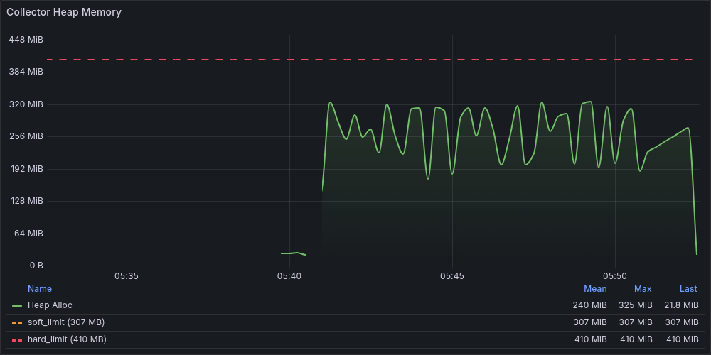
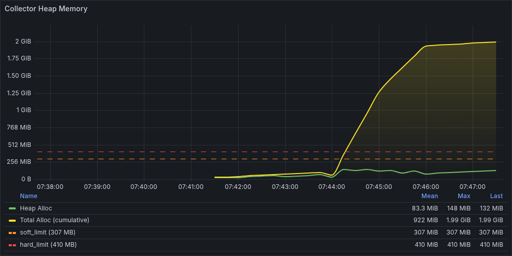
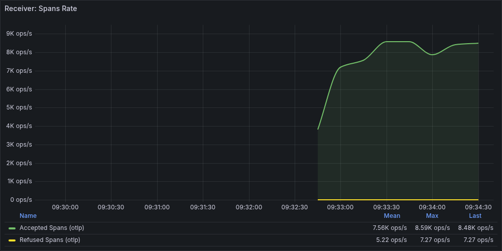
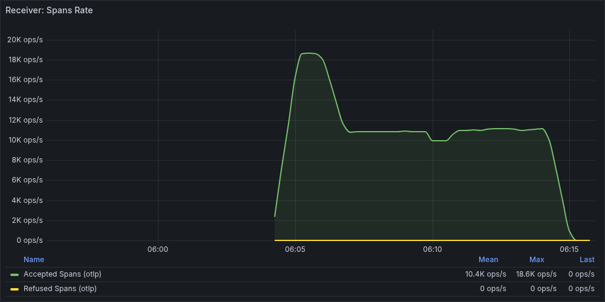
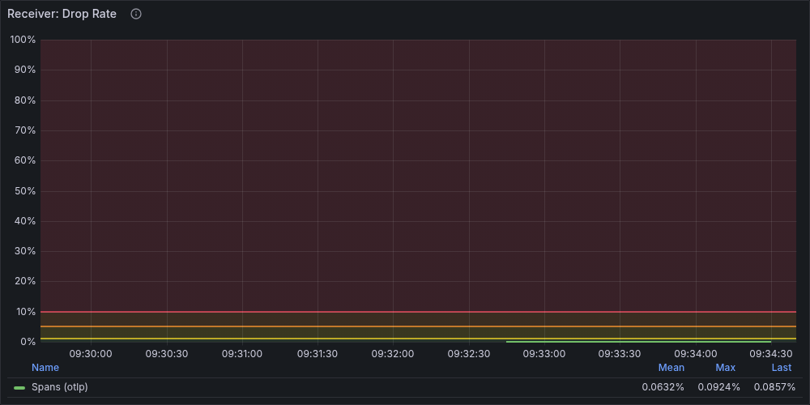
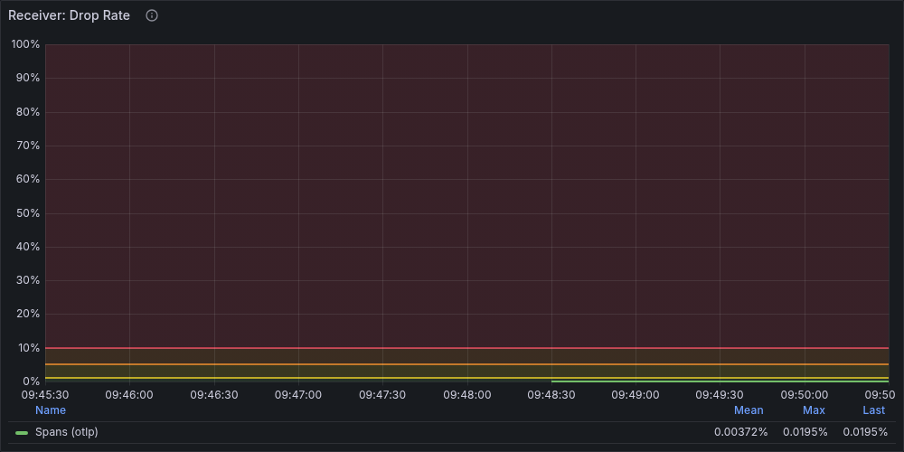
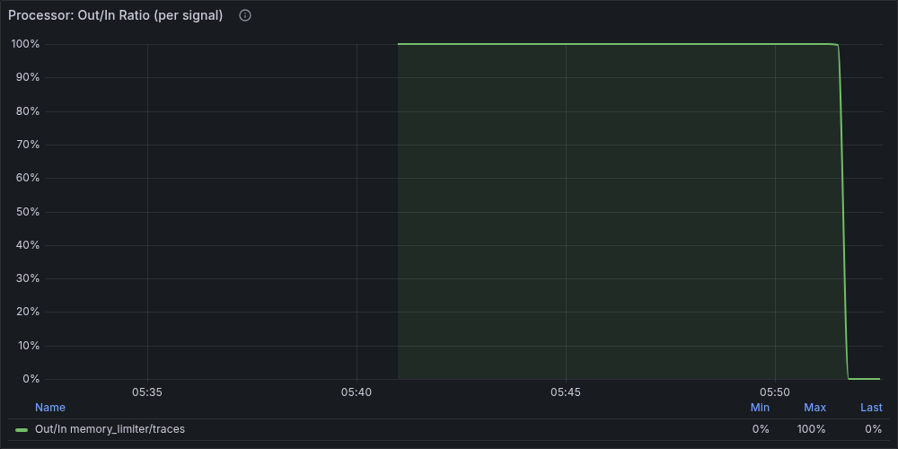
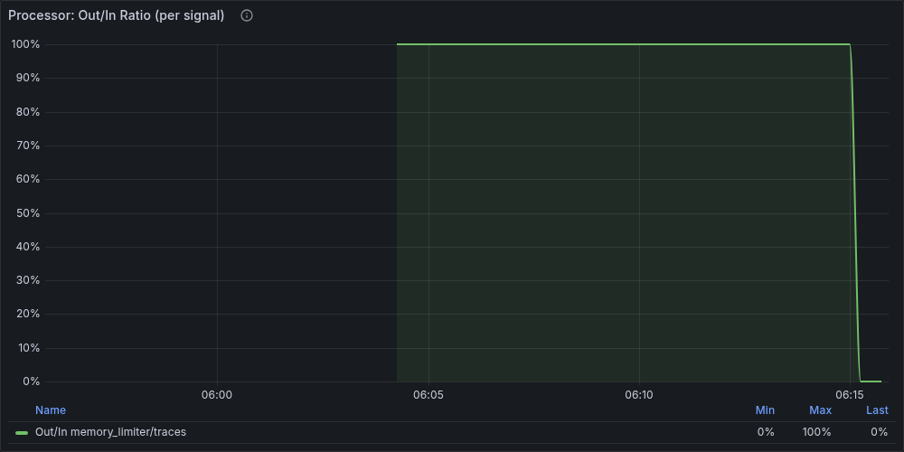

## 1. 概要

`tail_sampling` processor は、トレースの全スパンが揃うまで判定を待つため、`decision_wait` × 流量の積に比例してメモリを消費する。
このレポートでは、`decision_wait: 30s`（非最適化）と `decision_wait: 10s`（最適化）の2条件で同一負荷を与え、
メモリ挙動の違いを Grafana メトリクスと pprof で観測・比較する。

## 2. 再現手順

### 2.1 Collector 設定（非最適化 — 問題設定）

```yaml
processors:
  memory_limiter:
    check_interval: 1s
    limit_percentage: 80
    spike_limit_percentage: 20

  tail_sampling:
    decision_wait: 30s
    num_traces: 1000000
    expected_new_traces_per_sec: 10000
    policies:
      - name: always-sample
        type: always_sample
```

ポイント:
- `decision_wait: 30s` は一般的な設定（5-10s）と比べて長い
- `num_traces: 1000000` は実質無制限で、上限によるドロップが発生しない
- `always_sample` により全トレースが `decision_wait` 中バッファに保持される

### 2.2 Collector 設定（最適化）

```yaml
processors:
  tail_sampling:
    decision_wait: 10s          # 30s → 10s に短縮（唯一の差分）
    num_traces: 1000000
    expected_new_traces_per_sec: 10000
    policies:
      - name: always-sample
        type: always_sample
```

`decision_wait` のみを変更し、他のパラメータは同一条件に保つ。

### 2.3 負荷条件

両シナリオ共通（telemetrygen を使用）:

```
Tool:             telemetrygen (traces mode)
Duration:         2m0s
Rate:             1,500 traces/s（target）
Workers:          10
Child Spans:      5（1トレース = 6スパン = 9,000 spans/s 相当）
Container Memory: 512 MB
```

実行コマンド:

```bash
# 非最適化（decision_wait: 30s）
make run-tail-sampling

# 最適化（decision_wait: 10s）
make run-tail-sampling-optimized
```

> 注: telemetrygen のレートリミッタは厳密ではなく、実測では ~13,000 spans/s 程度が送出される。

## 3. Grafana での観測

### 3.1 Heap Memory の挙動

#### 非最適化（decision_wait: 30s）



負荷開始から約30秒で Heap が急騰し、440 MB に到達。`decision_wait` 中のトレースバッファが蓄積されるためである。

| フェーズ | 時間 | Heap | 説明 |
|---------|------|------|------|
| アイドル | 10:34-10:37 | 18-20 MB | GC が正常動作 |
| 負荷開始直後 | 10:37:31 | 96.50 MB | バッファ蓄積開始 |
| 急騰 | 10:37:46 | 226.89 MB | `decision_wait` 中のバッファが膨張 |
| ピーク | 10:38:01 | 440.83 MB | memory_limiter 発火開始 |
| 負荷中定常 | 10:38:16-10:39:16 | 155-388 MB | GC と memory_limiter の拮抗で大きく振動 |
| 回復 | 10:39:31 | 20.29 MB | 負荷終了、バッファ解放 |

> 注: 上記の値は Prometheus メトリクス `otelcol_process_runtime_heap_alloc_bytes` のエクスポートデータから取得した。

特徴: Heap が 400 MB 超に到達し、memory_limiter が持続的に発火。RSS は 641 MB まで上昇する。

#### 最適化（decision_wait: 10s）



`decision_wait` を 10s に短縮することで、バッファ保持量が 1/3 になり、Heap の挙動が大きく変化した。

| フェーズ | 時間 | Heap | 説明 |
|---------|------|------|------|
| アイドル | 10:56-10:57 | 23-28 MB | 正常動作 |
| 負荷開始直後 | 10:57:51 | 217.04 MB | 急騰するが 30s ほどではない |
| GC 回復 | 10:58:06 | 122.92 MB | GC が即座に介入、123 MB まで低下 |
| ピーク | 10:59:21 | 316.21 MB | 30s（441 MB）から **28% 低下** |
| 負荷中定常 | 10:58:06-10:59:36 | 123-316 MB | GC 振動はあるが **Refused ゼロ** |
| 回復 | 10:59:51 | 18.34 MB | 負荷終了、バッファ解放 |

特徴: ピーク値が 30s から 28% 低下。GC 回復が速く、memory_limiter が**一度も発火しない**。

#### 比較

| 指標 | 30s | 10s | 変化 |
|------|-----|-----|------|
| Heap ピーク | 440.83 MB | 316.21 MB | **-28%** |
| RSS ピーク | 641.41 MB | 501.54 MB | **-22%** |
| 定常レンジ | 155-388 MB | 123-316 MB | 低下 |
| memory_limiter 発火 | あり | **なし** | 解消 |

### 3.2 Receiver メトリクスの挙動

#### 受信スループット

**非最適化（30s）:**



**最適化（10s）:**



| 指標 | 30s | 10s | 変化 |
|------|-----|-----|------|
| Accepted rate（定常） | ~7,500/s | ~13,400/s | **+79%** |
| Accepted 累計 | 972,883 | 1,611,652 | **+66%** |
| 総送信スパン (loadgen) | 1,598,034 | 1,609,986 | +0.7% |

30s ではメモリ圧力による back-pressure が強く、受信レートが目標の半分程度に落ち込む。
10s ではメモリに余裕があるため、telemetrygen の送出をほぼ全量受信できている。

#### 拒否レート（memory_limiter 発火）

**非最適化（30s）:**



**最適化（10s）:**



| 指標 | 30s | 10s | 変化 |
|------|-----|-----|------|
| Refused rate ピーク | 7.29/s | 0/s | **-100%** |
| Refused 累計 | 732 spans | 0 spans | **-100%** |
| loadgen gRPC エラー回数 | 3回 | 0回 | **-100%** |

30s では `memory_limiter` が持続的に発火し、ピーク 7.29/s のスパンを拒否。Heap が 440 MB に達した時点で発火が始まり、テスト終了まで継続する。

10s では `memory_limiter` が **一度も発火しない**。`decision_wait` の短縮により、バッファ保持量が 1/3 になった効果で、
Heap ピーク（316 MB）が `spike_limit_percentage: 20` のソフトリミット（60% = 307 MB）付近に収まる。

### 3.3 パイプラインファネル分析

Receiver の rate メトリクスや loadgen のエラーログだけでは、実際にどれだけのスパンが失われたかを正確に把握できない。
`increase()` ベースの累計カウントと Tail Sampling 固有メトリクスを組み合わせることで、パイプライン全体のデータフローを定量化できる。

> **固有メトリクスの発見方法**: Prometheus で `curl -s http://localhost:9090/api/v1/label/__name__/values | jq -r '.data[]' | grep tail_sampling` を実行すると、tail_sampling processor が公開する固有メトリクスを列挙できる。詳細は [デバッグ基本技法](../debug-basics.md) のセクション 2.1 を参照。

#### エンドツーエンドのデータフロー

| ステージ | メトリクス | 30s | 10s |
|---------|-----------|-----|-----|
| Loadgen 送信 | （loadgen ログ） | 1,598,034 spans | 1,609,986 spans |
| Receiver Accepted | `increase(otelcol_receiver_accepted_spans_total)` | 972,883 (60.9%) | 1,611,652 (~100%) |
| Receiver Refused | `increase(otelcol_receiver_refused_spans_total)` | 732 (0.05%) | 0 (0%) |
| **クライアント側損失** | Loadgen - Accepted - Refused | **624,419 (39.1%)** | **~0 (~0%)** |
| パイプライン出力 | `increase(otelcol_exporter_sent_spans_total{exporter="debug"})` | 841,052 (52.6%) | 1,542,263 (95.8%) |
| Exporter Failed | `increase(otelcol_exporter_send_failed_spans_total)` | 0 | 0 |

> 注: パイプライン出力は debug exporter の送信数で計測。otlp exporter はバックエンドへのネットワーク遅延を含むため、テスト終了直後のスナップショットでは実際のパイプライン処理量を反映しない。

30s ではエンドツーエンドのスループットが **53%** まで低下し、送信スパンの約4割がクライアント側で失われる。10s に短縮するだけで **96%** に改善され、データ損失がほぼゼロになる。

#### データ損失の主経路

Receiver Refused（memory_limiter の直接拒否）は 30s でも **0.05%** に過ぎず、データ損失の主要因ではない。
損失の大部分は、Collector がメモリ圧力により gRPC エラーを返した際の**クライアント側タイムアウト**（`data refused due to high memory usage`）で発生している。

- 30s: クライアント側で 39.1%（~624,000 spans）が消失。loadgen ログでは gRPC エラー 3回のみ
- 10s: クライアント側損失 **ゼロ**。gRPC エラーも発生しない

loadgen のエラーログ回数（2回 vs 0回）だけでは、30s で 60 万スパンが失われている事実は見えない。

#### Tail Sampling 固有メトリクス

| メトリクス | 30s | 10s | 意味 |
|-----------|-----|-----|------|
| `new_trace_id_received` | 162,690 traces | 268,605 traces | Processor に到達した新規トレース数 |
| `count_traces_sampled` (decision=sampled) | 140,668 traces | 257,044 traces | サンプリング判定済みトレース数 |
| **判定待ちバックログ** | **22,022 traces (13.5%)** | **11,561 traces (4.3%)** | まだ decision_wait 中のトレース |
| `sampling_traces_on_memory` (ピーク) | 152,555 | 266,221 | メモリ上のトレース数 |
| `sampling_trace_dropped_too_early` | 0 | 0 | num_traces 上限による強制ドロップ |

注目すべき点:

1. **10s の方がメモリ上のトレース数が多い**（266,221 vs 152,555）。一見矛盾するが、10s ではメモリ圧力が低いため Collector がより多くのデータを受け入れ（Accepted +66%）、結果的に Processor により多くのトレースが流入する
2. **30s の判定バックログ率は 10s の約3倍**（13.5% vs 4.3%）。`decision_wait` が長いと判定が追いつかず、バッファが滞留する
3. **強制ドロップはゼロ**。`num_traces: 1000000` の上限には到達していない。データ損失は Tail Sampling 内部ではなく、上流の memory_limiter → gRPC 拒否 → クライアント側タイムアウトの経路で発生している

### 3.4 Processor パネル

**非最適化（30s）:**



**最適化（10s）:**



Processor の Out/In Ratio パネルで `memory_limiter` の発火状況を視覚的に確認できる。
30s では Out/In Ratio が負荷中に大きく落ち込む区間が多く、10s ではその落ち込みが軽減されている。

## 4. pprof での原因特定

### 4.1 解析手順

```bash
# 非最適化: peak プロファイルを Web UI で表示
make pprof-ui FILE=captures/03-05/103651/pprof/heap_103845.pprof

# 最適化: peak プロファイルを Web UI で表示
make pprof-ui FILE=captures/03-05/105646/pprof/heap_105911.pprof
```

**注意**: pprof ファイルのサイズ（バイト数）は inuse_space と相関しない。
ファイルサイズはユニークな関数・コールスタックの数に依存するため、
ピークファイルの特定には `go tool pprof -top` で各ファイルの inuse_space total を確認する必要がある。

### 4.2 peak プロファイルの比較

#### 非最適化（30s）— inuse_space total: 296.00 MB

<!-- pprof コールグラフ — 非最適化: 要キャプチャ -->

赤い太線が `processTraces` (cum 165.52 MB, 56%) を経由して pdata 層（`NewSpan` 74.52 MB, `CopyKeyValueSlice` 24.50 MB）に流れている。
`tailsamplingprocessor` がトレースを `decision_wait` 中保持し続ける結果、pdata のメモリが解放されない構造が視覚的にわかる。

| 順位 | Flat | Flat% | 関数 | 役割 |
|------|------|-------|------|------|
| 1 | 74.52 MB | 25.17% | `pdata/internal.NewSpan` | Span オブジェクトの生成 |
| 2 | 24.50 MB | 8.28% | `pdata/internal.CopyKeyValueSlice` | 属性キー・値のコピー |
| 3 | 20.00 MB | 6.76% | `tailsamplingprocessor.processTraces` | トレース処理・バッファ保持 |
| 4 | 16.50 MB | 5.57% | `pdata/internal.(*KeyValue).UnmarshalProto` | 属性キー値のデシリアライズ |
| 5 | 16.00 MB | 5.41% | `pdata/internal.CopyAnyValue` | 属性値のコピー |
| 6 | 15.27 MB | 5.16% | `tailsamplingprocessor.NewDropOldTracesLimiter` | tail_sampling のトレース管理 |

#### 最適化（10s）— inuse_space total: 198.71 MB

<!-- pprof コールグラフ — 最適化: 要キャプチャ -->

`processTraces` の cum は 111.01 MB (56%) で占有率は同等だが、pdata 層が大幅に縮小。
`NewSpan` が 74.52 MB → 35.01 MB に半減している。
`decision_wait` の短縮により、同時にバッファに保持されるトレース数が減った効果が現れている。

| 順位 | Flat | Flat% | 関数 | 役割 |
|------|------|-------|------|------|
| 1 | 35.01 MB | 17.62% | `pdata/internal.NewSpan` | Span オブジェクトの生成 |
| 2 | 26.50 MB | 13.34% | `tailsamplingprocessor.processTraces` | トレース処理・バッファ保持 |
| 3 | 15.27 MB | 7.68% | `tailsamplingprocessor.NewDropOldTracesLimiter` | tail_sampling のトレース管理 |
| 4 | 13.50 MB | 6.79% | `internal/sync.newIndirectNode` | concurrent map のノード |
| 5 | 8.50 MB | 4.28% | `pdata/internal.(*KeyValue).UnmarshalProto` | 属性キー値のデシリアライズ |
| 6 | 8.00 MB | 4.03% | `pdata/internal.CopyKeyValueSlice` | 属性キー・値のコピー |

### 4.3 pdata（トレースデータ保持）の比較

メモリ消費を機能別に分類すると、最も大きな差は **pdata 層**（トレースデータのバッファ）に現れる。

| カテゴリ | 30s | 10s | 変化 |
|---------|-----|-----|------|
| **pdata（トレースデータ保持）** | 165.52 MB (55.9%) | 78.51 MB (39.5%) | **-53%** |
| **tail_sampling 管理構造** | 35.27 MB (11.9%) | 41.77 MB (21.0%) | +18% |
| **concurrent map（sync）** | 12.50 MB (4.2%) | 20.50 MB (10.3%) | +64% |
| **その他（静的・ランタイム）** | 82.71 MB (27.9%) | 57.93 MB (29.2%) | -30% |
| **合計** | **296.00 MB** | **198.71 MB** | **-33%** |

重要な発見:
- `decision_wait` の短縮で最も影響を受けるのは **pdata 層**（53% 削減）。バッファ窓が 1/3 になった効果
- tail_sampling の管理構造（`NewDropOldTracesLimiter`: 15.27 MB）は `decision_wait` に依存せず一定
- concurrent map はスループット向上に伴い拡大（+64%）するが、pdata の削減量に比べると軽微
- **全体として 33% の削減** を達成し、memory_limiter 発火の有無が分かれる（Refused 732 → 0）

### 4.4 直接の確保者 vs 保持の原因者

pprof の `flat` 値で見ると、`tailsamplingprocessor` が直接確保するメモリ（`processTraces` の flat）は全体の 7-13%。
しかし、tail_sampling が保持を指示した結果として pdata が確保するメモリは `cum`（累積）値に含まれる。

```
30s: tailsamplingprocessor.processTraces — cum 165.52 MB (55.92%)
10s: tailsamplingprocessor.processTraces — cum 111.01 MB (55.87%)
```

両条件とも **cum の占有率は 56% でほぼ一致** している。`decision_wait` を変えても、
全メモリに占める tail_sampling の影響割合は一定で、絶対量だけが変わる。

pprof を読む際のポイント: `flat` が小さくても `cum` が大きい関数は「保持の原因者」である。
`tail_sampling` のメモリ問題を特定するには、`cum` 列に注目する必要がある。

## 5. メモリ肥大化のメカニズム

Tail Sampling は「全スパンが揃うまで判定を待つ」ため、
`decision_wait` 中のトレースがバッファに残る。

概算式:

```text
バッファメモリ ≈ decision_wait × スパン流量 × 平均スパンサイズ
```

実測値での検算:

| パラメータ | 30s | 10s |
|-----------|-----|-----|
| decision_wait | 30s | 10s |
| 実効スループット | ~8,100 spans/s | ~13,400 spans/s |
| 1 span あたりの推定サイズ（raw） | ~0.1 KB | ~0.1 KB |
| **概算バッファ（raw）** | **~24 MB** | **~13 MB** |
| **pprof 実測（pdata 層）** | **166 MB** | **79 MB** |
| **実測/概算 倍率** | **~6.9x** | **~6.1x** |

概算と実測の乖離（約6-7倍）は、以下のオーバーヘッドに起因する:
- Go のオブジェクトヘッダとアライメント（各フィールドに 16-24 bytes のラッパー）
- Protocol Buffers のデシリアライズ構造（`UnmarshalProto` が flat の 5-8% を占める）
- スライスの容量確保（Go は `append` 時に2倍に拡張する）
- トレース管理構造（concurrent map のノード、`DropOldTracesLimiter` のエントリ）
- GC が解放タイミングをまたぐ未回収オブジェクト

> 注: 本テストは telemetrygen のミニマルスパン（カスタム属性なし）を使用しているため、raw サイズが小さくオーバーヘッド倍率が大きく見える。実運用でカスタム属性が多いスパン（~1 KB/span）の場合、倍率は 2-3x 程度に収束する。

この保持量が大きいと、GC 負荷が上がり、処理遅延やスパン拒否が発生する。

## 6. パラメータ最適化

### 6.1 Step 1: `decision_wait` の短縮

`decision_wait` を 30s → 10s に短縮するだけで、以下の改善が得られた:

| 指標 | 30s | 10s | 改善 |
|------|-----|-----|------|
| **パイプライン スループット** | **52.6%** | **95.8%** | **+43.2pt** |
| Receiver Accepted (累計) | 972,883 | 1,611,652 | **+66%** |
| クライアント側損失率 | 39.1% | ~0% | **-39.1pt** |
| Heap ピーク | 440.83 MB | 316.21 MB | **28% 削減** |
| RSS ピーク | 641.41 MB | 501.54 MB | **22% 削減** |
| pprof inuse_space | 296 MB | 199 MB | **33% 削減** |
| pdata 消費 | 166 MB | 79 MB | **53% 削減** |
| Refused rate ピーク | 7.29/s | 0/s | **100% 削減** |
| Refused 累計 | 732 | 0 | **100% 削減** |
| loadgen gRPC エラー | 3回 | 0回 | **100% 削減** |

`decision_wait` の短縮は、最も即効性が高く、副作用が小さい最適化手段である。
パイプラインスループットが 53% → 96% に改善され、スパン拒否が完全にゼロになるという効果は、
loadgen のエラーログ回数（2→0）だけでは見えない。パイプラインファネル分析（セクション 3.3）によって初めて可視化される。

### 6.2 Step 2: さらなる改善に向けて

Step 1 で `memory_limiter` の発火はゼロになったが、Heap ピーク（316 MB）は
ソフトリミット（60% = 307 MB）付近であり、負荷条件によっては再発しうる。
さらなるマージンを確保するには:

- **メモリ増量**: コンテナメモリを増やし、`limit_percentage` の絶対値を上げる
- **`spike_limit_percentage` の緩和**: 20% → 25% にすることでソフトリミットを引き上げる
- **`num_traces` の適正化**: メモリ予算から逆算して上限を設定する
- **ポリシーの見直し**: `always_sample` → 確率サンプリングやエラーベースのポリシーに変更し、保持量を減らす

最適化後の設定例:

```yaml
processors:
  tail_sampling:
    decision_wait: 10s
    num_traces: 50000
    expected_new_traces_per_sec: 5000
    policies:
      - name: error-policy
        type: status_code
        status_code:
          status_codes: [ERROR]
      - name: probabilistic-policy
        type: probabilistic
        probabilistic:
          sampling_percentage: 10
```

これらの詳細は [ベストプラクティス](../best-practices.md) で扱う。

## 7. 監視ポイント

### 7.1 Heap 上昇の検知

Tail Sampling 特有の「急騰 → 高止まり → 解放」パターンを検知するには、
Heap の絶対値と変化率の両方を監視する。

```promql
# Heap が閾値（例: 300MB）を超えたら警告
otelcol_process_runtime_heap_alloc_bytes{job="otel-collector-self"} > 300e6

# 5分間の Heap 増加率が急激な場合
deriv(otelcol_process_runtime_heap_alloc_bytes{job="otel-collector-self"}[5m]) > 10e6
```

### 7.2 Refused 発生の検知

```promql
# memory_limiter によるスパン拒否が発生
rate(otelcol_receiver_refused_spans_total{job="otel-collector-self"}[5m]) > 0
```

### 7.3 スループット低下の検知

```promql
# 受信スループットが期待値の50%を下回る
rate(otelcol_receiver_accepted_spans_total{job="otel-collector-self"}[5m]) < 2500
```

## 8. まとめ

- `tail_sampling` は `decision_wait` に比例してメモリを消費する。バッファサイズは `decision_wait × throughput × per_span_memory` で見積もれるが、実測は raw サイズの 6-7 倍になる（カスタム属性ありの場合は 2-3 倍）
- `decision_wait: 30s → 10s` の短縮で、パイプラインスループットが **53% → 96%** に改善。pdata のメモリ消費は **53% 削減**、スパン拒否は **ゼロ**に
- データ損失の主経路は Collector 内部の Refused ではなく、**クライアント側のタイムアウト**（`data refused due to high memory usage`）である。30s では Refused 0.05% にもかかわらず、クライアント側で 39% のスパンが消失する
- pprof の `flat` ではなく `cum` を見ることで、tail_sampling が「保持の原因者」であることを特定できる。cum の占有率は両条件で **56%** と一致し、`decision_wait` を変えても影響割合は一定で絶対量のみ変わる
- `decision_wait: 10s` で `memory_limiter` の発火はゼロになるが、Heap ピーク（316 MB）はソフトリミット付近であり、負荷増大時には追加の設計変更が必要
