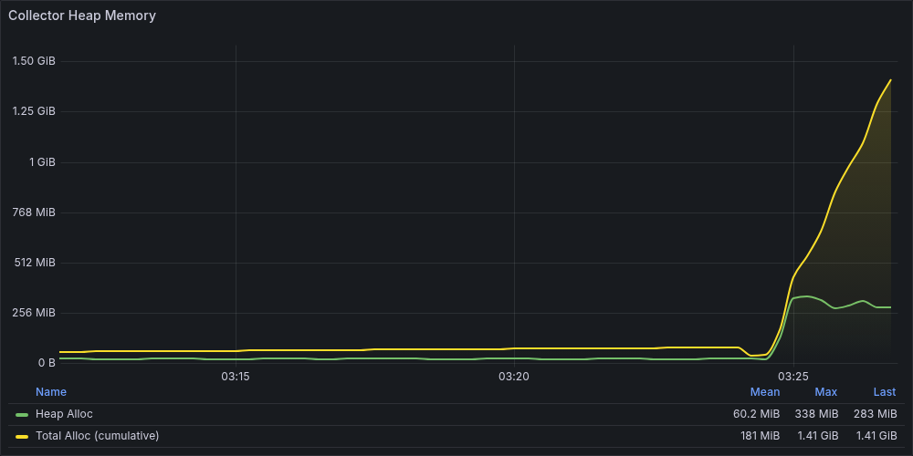
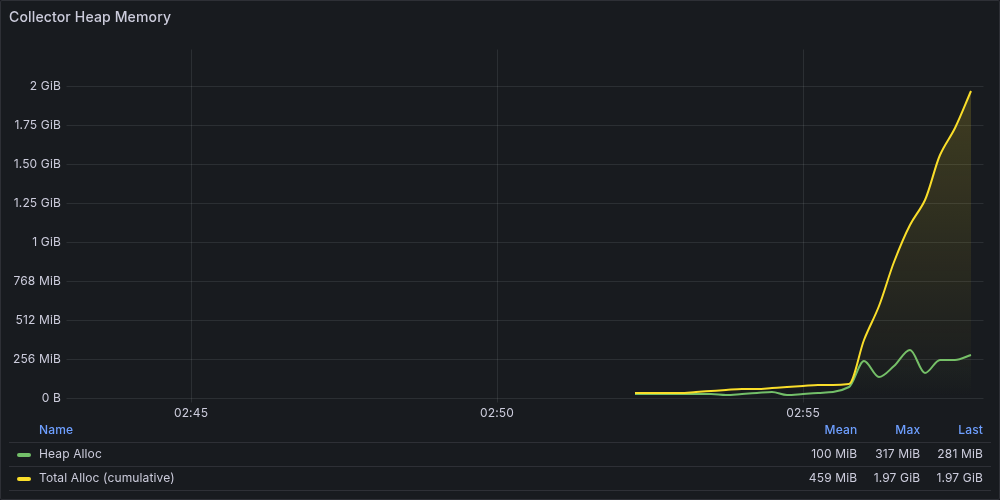
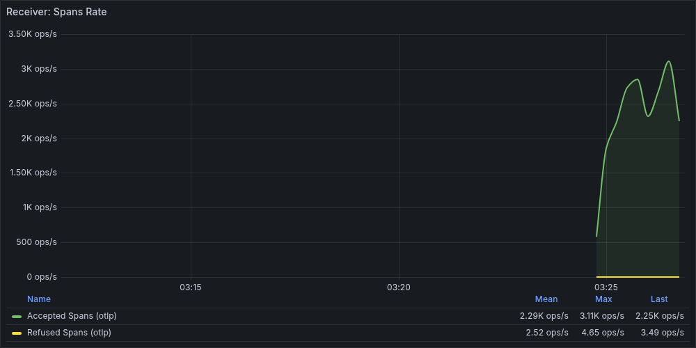
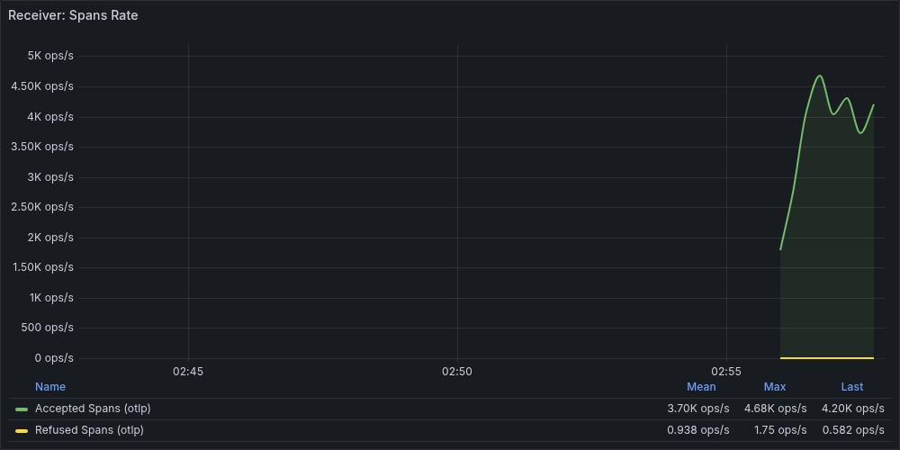
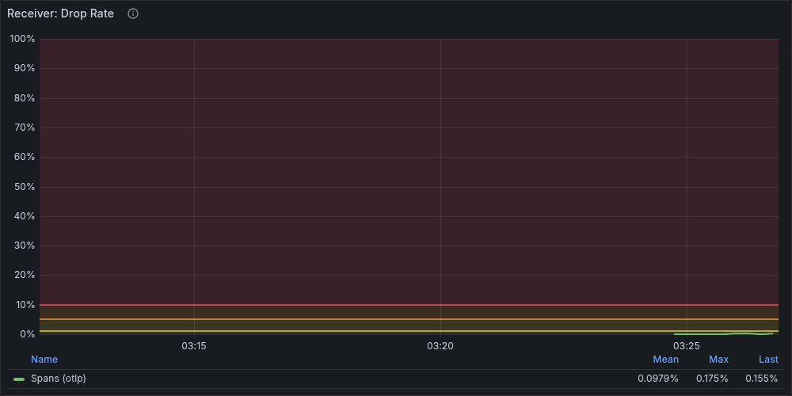
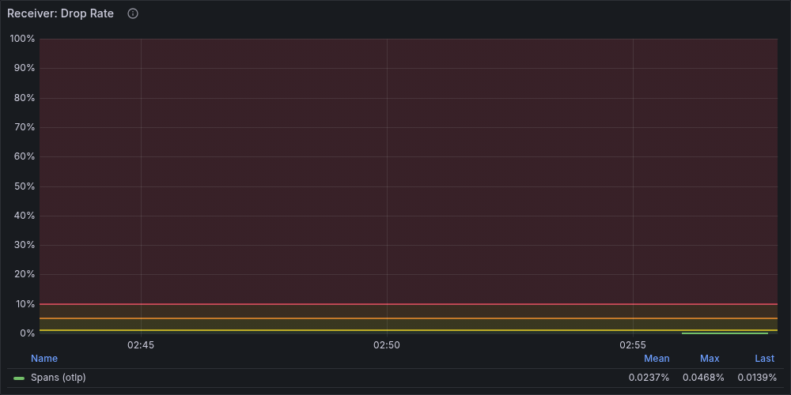
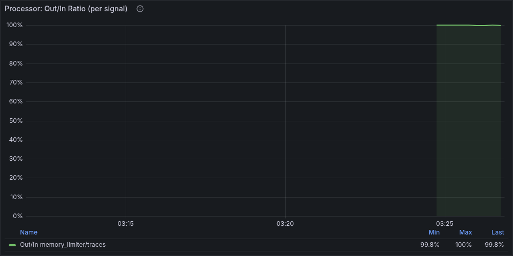
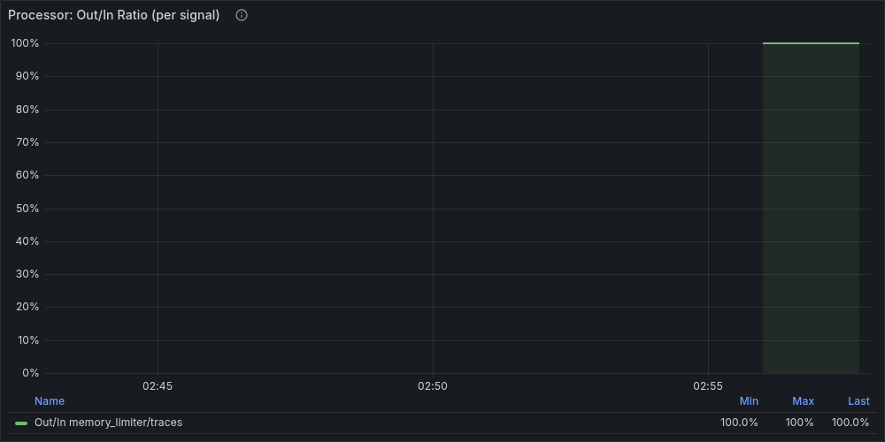

## 1. 概要

`tail_sampling` processor は、トレースの全スパンが揃うまで判定を待つため、`decision_wait` × 流量の積に比例してメモリを消費する。
このレポートでは、`decision_wait: 30s`（非最適化）と `decision_wait: 10s`（最適化）の2条件で同一負荷を与え、
メモリ挙動の違いを Grafana メトリクスと pprof で観測・比較する。

## 2. 再現手順

### 2.1 Collector 設定（非最適化 — 問題設定）

```yaml
processors:
  memory_limiter:
    check_interval: 1s
    limit_percentage: 80
    spike_limit_percentage: 20

  tail_sampling:
    decision_wait: 30s
    num_traces: 1000000
    expected_new_traces_per_sec: 10000
    policies:
      - name: always-sample
        type: always_sample
```

ポイント:
- `decision_wait: 30s` は公式推奨（5-10s）の3-6倍
- `num_traces: 1000000` は実質無制限で、上限によるドロップが発生しない
- `always_sample` により全トレースが `decision_wait` 中バッファに保持される

### 2.2 Collector 設定（最適化）

```yaml
processors:
  tail_sampling:
    decision_wait: 10s          # 30s → 10s に短縮（唯一の差分）
    num_traces: 1000000
    expected_new_traces_per_sec: 10000
    policies:
      - name: always-sample
        type: always_sample
```

`decision_wait` のみを変更し、他のパラメータは同一条件に保つ。

### 2.3 負荷条件

両シナリオ共通:

```
Scenario:         sustained
Duration:         2m0s
Workers:          10
Spans/sec:        5,000
Span Depth:       5（1トレース = 6スパン）
Attribute Size:   128 bytes
Attribute Count:  8
Container Memory: 512 MB
```

実行コマンド:

```bash
# 非最適化（decision_wait: 30s）
make pprof-tail-sampling-full

# 最適化（decision_wait: 10s）
make pprof-tail-sampling-optimized-full
```

## 3. Grafana での観測

### 3.1 Heap Memory の挙動

#### 非最適化（decision_wait: 30s）



負荷開始から約30秒で Heap が急騰し、300 MB 超に到達。`decision_wait` 中のトレースバッファが蓄積されるためである。

| フェーズ | 時間 | Heap | 説明 |
|---------|------|------|------|
| アイドル | 12:11-12:24 | 19-23 MB | GC が正常動作、約2分周期で解放 |
| 負荷開始直後 | 12:24:52 | 190 MB | 21 MB から約9倍に急騰 |
| ピーク | 12:25:22 | 344 MB | `decision_wait: 30s` 分のバッファ蓄積 |
| 負荷中定常 | 12:25:37-12:26:52 | 156-344 MB | GC の振動により大きく変動 |

特徴: Heap が 300 MB 以上に張り付き、GC による解放が追いつかない。

#### 最適化（decision_wait: 10s）



`decision_wait` を 10s に短縮することで、バッファ保持量が 1/3 になり、Heap の挙動が変化した。

| フェーズ | 時間 | Heap | 説明 |
|---------|------|------|------|
| アイドル | 11:52-11:55 | 21-39 MB | 正常動作 |
| 負荷開始直後 | 11:55:57 | 245 MB | 急騰（30s と同等の立ち上がり） |
| ピーク | 11:56:42 | 332 MB | 30s（344 MB）と近いが一時的 |
| 負荷中定常 | 11:56:57-11:57:42 | 163-294 MB | GC の振動幅は大きいが、**復帰が速い** |

特徴: ピーク値は 30s に近いが、10s ではバッファが速く解放されるため、定常的な高止まりが緩和される。

#### 比較

| 指標 | 30s | 10s | 変化 |
|------|-----|-----|------|
| Heap ピーク | 344 MB | 332 MB | -4% |
| 定常中央値 | ~320 MB | ~250 MB | -22% |
| GC 復帰後の谷 | 156 MB | 140 MB | -10% |

### 3.2 RSS Memory の挙動

| 指標 | 30s | 10s |
|------|-----|-----|
| アイドル | 46-47 MB | 173-197 MB |
| ピーク | 514 MB | 493 MB |
| 負荷中定常 | 466-514 MB | 343-493 MB |

30s ではコンテナメモリ上限（512 MB）に極めて近い RSS に達しており、OOM Kill のリスクがある。
10s では RSS ピークも下がるが、Go runtime の mmap 保持により、Heap 解放後も RSS は即座には低下しない。

### 3.3 Receiver メトリクスの挙動

#### 受信スループット




| 指標 | 30s | 10s | 変化 |
|------|-----|-----|------|
| Accepted rate 範囲 | 1,180-3,079/s | 1,535-4,679/s | +48% (中央値) |
| 目標 5,000/s に対する達成率 | ~50% | ~74% | 大幅改善 |
| 総送信スパン | 607,218 | 620,262 | +2% |

30s ではバッファ処理がボトルネックとなり、back-pressure が強く発生。
10s ではバッファ回転が速いため、受信能力が向上している。

#### 拒否レート（memory_limiter 発火）




| 指標 | 30s | 10s | 変化 |
|------|-----|-----|------|
| Refused rate 範囲 | 0.58-4.65/s | 0.54-1.75/s | -63% (ピーク比) |
| Refused rate ピーク | 4.65/s | 1.75/s | -62% |
| loadgen エラー回数 | 4回 | 1回 | -75% |

30s では `memory_limiter` が持続的に発火し、ピーク 4.65/s のスパンを拒否。
10s では発火頻度・強度ともに大幅に低下したが、**完全にはゼロにならなかった**。

この残存する発火は、`spike_limit_percentage: 20` によるソフトリミット（60% = 307 MB）を
GC の振動で一時的に超えるために発生する。パラメータ調整だけでは解消できない構造的な要因であり、
完全な解消にはメモリ増量または `spike_limit_percentage` の調整が必要になる。
この点は [ベストプラクティス](../best-practices.md) で詳述する。

### 3.4 Processor パネル




Processor の Out/In Ratio パネルで `memory_limiter` の発火状況を視覚的に確認できる。
30s では Out/In Ratio が負荷中に大きく落ち込む区間が多く、10s ではその落ち込みが軽減されている。

## 4. pprof での原因特定

### 4.1 解析手順

```bash
# 保存先を確認
cat captures/last_capture.txt

# peak プロファイルの特定
make pprof-list DIR=$(cat captures/last_capture.txt)

# peak プロファイルを Web UI で表示（Top / Flame Graph）
make pprof-ui FILE=<peak ファイルのパス>

# 差分を見る
make pprof-diff-auto DIR=$(cat captures/last_capture.txt)
```

### 4.2 peak プロファイルの比較

#### 非最適化（30s）— inuse_space total: 320.05 MB

| 順位 | Flat | Flat% | 関数 | 役割 |
|------|------|-------|------|------|
| 1 | 161.53 MB | 50.47% | `pdata/internal.(*AnyValue).UnmarshalProto` | スパン属性のデシリアライズ・保持 |
| 2 | 35.51 MB | 11.09% | `pdata/internal.CopyKeyValueSlice` | 属性キー・値のコピー |
| 3 | 25.51 MB | 7.97% | `pdata/internal.NewSpan` | Span オブジェクトの生成 |
| 4 | 15.50 MB | 4.84% | `pdata/internal.CopyAnyValue` | 属性値のコピー |
| 5 | 15.27 MB | 4.77% | `tailsamplingprocessor.NewDropOldTracesLimiter` | tail_sampling のトレース管理 |
| 6 | 12.80 MB | 4.00% | `grpc/mem.NewTieredBufferPool` | gRPC 受信バッファプール |

#### 最適化（10s）— inuse_space total: 201.35 MB

| 順位 | Flat | Flat% | 関数 | 役割 |
|------|------|-------|------|------|
| 1 | 84.01 MB | 41.72% | `pdata/internal.(*AnyValue).UnmarshalProto` | スパン属性のデシリアライズ・保持 |
| 2 | 18.00 MB | 8.94% | `pdata/internal.CopyKeyValueSlice` | 属性キー・値のコピー |
| 3 | 15.27 MB | 7.58% | `tailsamplingprocessor.NewDropOldTracesLimiter` | tail_sampling のトレース管理 |
| 4 | 14.00 MB | 6.95% | `pdata/internal.NewSpan` | Span オブジェクトの生成 |
| 5 | 12.80 MB | 6.35% | `grpc/mem.NewTieredBufferPool` | gRPC 受信バッファプール |
| 6 | 9.00 MB | 4.47% | `tailsamplingprocessor.processTraces` | トレース処理本体 |

### 4.3 pdata（トレースデータ保持）の比較

メモリ消費を機能別に分類すると、最も大きな差は **pdata 層**（トレースデータのバッファ）に現れる。

| カテゴリ | 30s | 10s | 変化 |
|---------|-----|-----|------|
| **pdata（トレースデータ保持）** | 238.05 MB (74.4%) | 120.51 MB (59.9%) | **-49%** |
| **tail_sampling 管理構造** | 15.27 MB (4.8%) | 15.27 MB (7.6%) | 変化なし |
| **gRPC バッファ** | 12.80 MB (4.0%) | 12.80 MB (6.4%) | 変化なし |
| **その他** | 53.93 MB (16.8%) | 52.77 MB (26.2%) | -2% |
| **合計** | **320.05 MB** | **201.35 MB** | **-37%** |

重要な発見:
- `decision_wait` の短縮で直接影響を受けるのは **pdata 層のみ**（49% 削減）
- tail_sampling の管理構造（`NewDropOldTracesLimiter`: 15.27 MB）は `decision_wait` に依存せず一定
- gRPC バッファプール（12.80 MB）も同様に一定
- つまり、`decision_wait` の調整は **バッファに保持されるトレースデータ量** にのみ効く

### 4.4 直接の確保者 vs 保持の原因者

pprof の `flat` 値で見ると、`tailsamplingprocessor` が直接確保するメモリは全体の 5-8% に過ぎない。
しかし、tail_sampling が保持を指示した結果として pdata が確保するメモリ（pdata 層全体）は
`cum`（累積）値に含まれる。

```
30s: tailsamplingprocessor.processTraces — cum 88.01 MB (27.50%)
10s: tailsamplingprocessor.processTraces — cum 60.01 MB (29.80%)
```

pprof を読む際のポイント: `flat` が小さくても `cum` が大きい関数は「保持の原因者」である。
`tail_sampling` のメモリ問題を特定するには、`cum` 列に注目する必要がある。

## 5. メモリ肥大化のメカニズム

Tail Sampling は「全スパンが揃うまで判定を待つ」ため、
`decision_wait` 中のトレースがバッファに残る。

概算式:

```text
バッファメモリ ≈ decision_wait × スパン流量 × 平均スパンサイズ
```

実測値での検算:

| パラメータ | 30s | 10s |
|-----------|-----|-----|
| decision_wait | 30s | 10s |
| 実効スループット | ~2,500 spans/sec | ~3,700 spans/sec |
| 1 span あたりのサイズ | ~1 KB | ~1 KB |
| **概算バッファ** | **75 MB** | **37 MB** |
| **pprof 実測（pdata 層）** | **238 MB** | **121 MB** |
| **実測/概算 倍率** | **3.2x** | **3.3x** |

概算と実測の乖離（約3倍）は、以下のオーバーヘッドに起因する:
- Go のオブジェクトヘッダとアライメント
- Protocol Buffers のデシリアライズ構造（`UnmarshalProto` が flat の 40-50% を占める）
- スライスの容量確保（Go は `append` 時に2倍に拡張する）
- GC が解放タイミングをまたぐ未回収オブジェクト

この保持量が大きいと、GC 負荷が上がり、処理遅延やスパン拒否が発生する。

## 6. 他シナリオとの鑑別

| 指標 | Tail Sampling | 高カーディナリティ |
|------|---------------|---------------------|
| Heap パターン | 急騰 → 高止まり → 解放 | 右肩上がり（戻らない） |
| 負荷停止後 | 回復する | 回復しない |
| GC の効果 | 一時的に下がる | ほぼ効かない |
| 主因 | 時間軸のバッファリング | 空間軸の状態膨張 |
| pprof top | `tailsamplingprocessor` | `groupbyattrs` / `spanmetrics` の内部 map |
| 対処 | `decision_wait` の短縮 | カーディナリティの削減 |

## 7. パラメータ最適化

### 7.1 Step 1: `decision_wait` の短縮

`decision_wait` を 30s → 10s に短縮するだけで、以下の改善が得られた:

| 指標 | 30s | 10s | 改善 |
|------|-----|-----|------|
| pprof inuse_space | 320 MB | 201 MB | **37% 削減** |
| pdata 消費 | 238 MB | 121 MB | **49% 削減** |
| Refused rate ピーク | 4.65/s | 1.75/s | **62% 削減** |
| loadgen エラー | 4回 | 1回 | **75% 削減** |
| Accepted rate 中央値 | ~2,500/s | ~3,700/s | **48% 向上** |

`decision_wait` の短縮は、最も即効性が高く、副作用が小さい最適化手段である。

### 7.2 Step 2: さらなる改善に向けて

Step 1 だけでは、GC の振動で `spike_limit_percentage` のソフトリミットを一時的に超えるため、
低頻度ながら `memory_limiter` の発火が残る。完全に解消するには:

- **メモリ増量**: コンテナメモリを増やし、`limit_percentage` の絶対値を上げる
- **`spike_limit_percentage` の緩和**: 20% → 25% にすることでソフトリミットを引き上げる
- **`num_traces` の適正化**: メモリ予算から逆算して上限を設定する
- **ポリシーの見直し**: `always_sample` → 確率サンプリングやエラーベースのポリシーに変更し、保持量を減らす

最適化後の設定例:

```yaml
processors:
  tail_sampling:
    decision_wait: 10s
    num_traces: 50000
    expected_new_traces_per_sec: 5000
    policies:
      - name: error-policy
        type: status_code
        status_code:
          status_codes: [ERROR]
      - name: probabilistic-policy
        type: probabilistic
        probabilistic:
          sampling_percentage: 10
```

これらの詳細は [ベストプラクティス](../best-practices.md) で扱う。

## 8. 監視ポイント

### 8.1 Heap 上昇の検知

Tail Sampling 特有の「急騰 → 高止まり → 解放」パターンを検知するには、
Heap の絶対値と変化率の両方を監視する。

```promql
# Heap が閾値（例: 300MB）を超えたら警告
otelcol_process_runtime_heap_alloc_bytes{job="otel-collector-self"} > 300e6

# 5分間の Heap 増加率が急激な場合
deriv(otelcol_process_runtime_heap_alloc_bytes{job="otel-collector-self"}[5m]) > 10e6
```

### 8.2 Refused 発生の検知

```promql
# memory_limiter によるスパン拒否が発生
rate(otelcol_receiver_refused_spans_total{job="otel-collector-self"}[5m]) > 0
```

### 8.3 スループット低下の検知

```promql
# 受信スループットが期待値の50%を下回る
rate(otelcol_receiver_accepted_spans_total{job="otel-collector-self"}[5m]) < 2500
```

## 9. まとめ

- `tail_sampling` は `decision_wait` に比例してメモリを消費する。バッファサイズは概算式で見積もれるが、実測は概算の約3倍になる
- `decision_wait: 30s → 10s` の短縮だけで、pdata のメモリ消費が **49% 削減**、スパン拒否率が **62% 削減** された
- pprof の `flat` ではなく `cum` を見ることで、tail_sampling が「保持の原因者」であることを特定できる
- 完全に `memory_limiter` の発火をゼロにするには、`decision_wait` の調整に加えてメモリ設計の見直しが必要
- Heap パターン（急騰 → 解放）で高カーディナリティ（右肩上がり）との鑑別が可能
